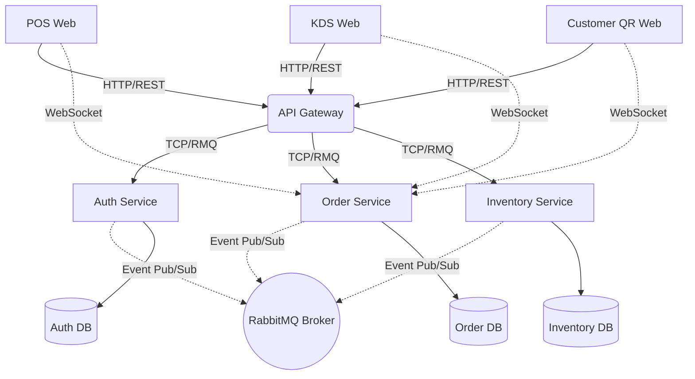

# Kiến Trúc Hệ Thống (System Architecture)

Hệ thống được thiết kế theo mô hình **Microservices Architecture** với mục tiêu phân tách rõ ràng trách nhiệm, tăng khả năng mở rộng (scalability) và dễ dàng bảo trì.

## 1. Sơ đồ Tổng quan

## 2. Database-per-Service Pattern
Để đảm bảo tính độc lập (loose coupling), mỗi Microservice sở hữu một Database PostgreSQL riêng biệt. Dữ liệu không bao giờ được truy cập chéo trực tiếp qua Database, mà phải thông qua việc gọi nội bộ (Message Pattern) hoặc bắt sự kiện (Event Pattern).

- **Auth DB (`5432`):** Lưu trữ thông tin người dùng, mật khẩu đã mã hóa (Bcrypt) và quyền hạn (Roles).
- **Order DB (`5435`):** Lưu trữ chi tiết đơn hàng, món ăn, topping, phương thức thanh toán.
- **Inventory DB (`5436`):** Lưu trữ định mức nguyên vật liệu và lịch sử xuất nhập kho.

## 3. Cơ chế Bảo mật (Stateless JWT & RBAC)
**API Gateway** đóng vai trò là chốt chặn an ninh duy nhất của hệ thống:
1. **Authentication:** Khi client gọi `/auth/login`, Gateway ủy quyền qua RabbitMQ cho `auth-service` xác thực. Nếu đúng, `auth-service` trả về JWT Token.
2. **Authorization (RBAC Guard):** Mọi request tiếp theo phải mang Header `Authorization: Bearer <token>`. Tại Gateway, một Global Guard sẽ giải mã Token này:
   - Các API công khai được đánh dấu `@Public` sẽ được bỏ qua.
   - Các API nghiệp vụ sẽ yêu cầu Roles cụ thể (ví dụ `@Roles('ADMIN', 'MANAGER')`). Nếu Token không chứa Role hợp lệ, Gateway trả về `403 Forbidden` ngay lập tức, không làm phiền đến các Microservice bên dưới.

## 4. Cơ chế Event-Driven & Realtime
- **Bất đồng bộ (RabbitMQ):** Khi đơn hàng được thanh toán thành công tại `order-service`, nó không gọi trực tiếp sang `inventory-service`. Thay vào đó, nó "phát thanh" (emit) một sự kiện `order_completed` lên RabbitMQ. `inventory-service` lắng nghe sự kiện này và âm thầm trừ kho ở background.
- **Realtime (Socket.IO):** `order-service` tự tổ chức một Socket Server (Port 3004). Mỗi khi trạng thái đơn đổi (Tạo mới -> Bếp đang làm -> Bếp làm xong), nó sẽ Emit sự kiện trực tiếp xuống tất cả các thiết bị KDS, POS và Customer Web để cập nhật giao diện ngay lập tức mà không cần F5.
