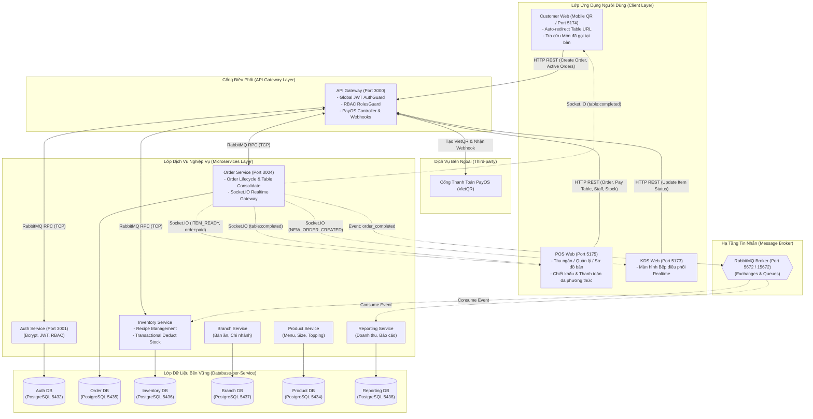

# Kiến Trúc Hệ Thống (System Architecture)

Hệ thống được thiết kế theo mô hình **Microservices Architecture** kết hợp **Event-Driven Architecture (EDA)** nhằm đảm bảo tính độc lập, khả năng mở rộng quy mô linh hoạt (scalability) và độ chịu lỗi cao cho chuỗi F&B đa chi nhánh.

---

## 1. Sơ đồ Kiến trúc Tổng thể (Overall System Architecture)

---

## 2. Database-per-Service Pattern & Persistent Storage

Hệ thống áp dụng triệt để nguyên lý **Database-per-Service**: mỗi Microservice quản lý toàn quyền một cơ sở dữ liệu PostgreSQL độc lập, ngăn chặn hoàn toàn việc join bảng xuyên service hay vi phạm tính đóng gói.

### Cơ chế Named Persistent Volumes trong Docker
Nhằm giải quyết triệt để rủi ro mất dữ liệu khi container bị dừng hoặc dựng lại (`docker compose down` / `docker compose up -d --build`), toàn bộ cơ sở dữ liệu và message broker được gắn với các **Named Volumes** bền vững tại `docker-compose.yml`:

| Dịch vụ Container | Cổng Host | Named Volume | Đường dẫn Mount trong Container |
| :--- | :--- | :--- | :--- |
| `fnb_postgres_auth` | `5432` | `postgres_auth_data` | `/var/lib/postgresql/data` |
| `fnb_postgres_product`| `5434` | `postgres_product_data` | `/var/lib/postgresql/data` |
| `fnb_postgres_order` | `5435` | `postgres_order_data` | `/var/lib/postgresql/data` |
| `fnb_postgres_inventory`| `5436` | `postgres_inventory_data` | `/var/lib/postgresql/data` |
| `fnb_postgres_branch` | `5437` | `postgres_branch_data` | `/var/lib/postgresql/data` |
| `fnb_postgres_reporting`| `5438` | `postgres_reporting_data` | `/var/lib/postgresql/data` |
| `fnb_rabbitmq` | `5672`, `15672`| `rabbitmq_data` | `/var/lib/rabbitmq` |

---

## 3. Kiến Trúc Hướng Sự Kiện & Tính Toàn Vẹn (Event-Driven & SAGA)

Nhằm tối ưu thời gian phản hồi cho các giao dịch tại quầy thu ngân (POS) và giảm độ trễ cho người dùng:
1. **Giao tiếp Bất đồng bộ (Pub/Sub):** Khi một đơn hàng hoàn tất thanh toán (`status = COMPLETED`), `order-service` phát sự kiện `order_completed` lên RabbitMQ exchange rồi trả về kết quả ngay cho POS mà không cần chờ kho phản hồi.
2. **Transaction Rollback tại Inventory Service:**
   - `inventory-service` nhận sự kiện `order_completed` và mở một **TypeORM Database Transaction** thông qua `QueryRunner`.
   - Với từng sản phẩm trong đơn, hệ thống tra cứu công thức định mức (`Recipe`) theo đúng `size` và `toppings`.
   - Nếu số lượng nguyên liệu trong kho đủ đáp ứng, hệ thống ghi nhận trừ kho (`quantity - required`) và chốt giao dịch (`commitTransaction`).
   - Nếu bất kỳ nguyên liệu nào không đủ tồn kho, toàn bộ giao dịch được hoàn tác tự động (`rollbackTransaction`) và phát cảnh báo kiểm kho, bảo vệ toàn vẹn dữ liệu. Cơ chế này đã được xác thực qua bộ Jest Unit Tests độc lập.

---

## 4. Socket.IO Realtime Gateway & Phân Tách Chi Nhánh (Room Isolation)

Order Service tổ chức một WebSocket Server độc lập lắng nghe tại cổng `3004`:
- **Room Isolation (`joinBranchRoom`):** Khi POS Web, KDS Web hoặc Customer Web khởi chạy, ứng dụng gửi sự kiện `joinBranchRoom(branchId)`. Socket Server sẽ đưa client vào room riêng biệt (ví dụ: `branch_1`, `branch_2`).
- **Phân phối sự kiện đúng địa chỉ:**
  - Đơn hàng mới từ QR bàn chi nhánh 1 chỉ kích hoạt thông báo trên màn hình KDS của chi nhánh 1 (`NEW_ORDER_CREATED`).
  - Món hoàn thành tại bếp chi nhánh 1 chỉ kích hoạt âm báo và Toast nổi trên POS của chi nhánh 1 (`ITEM_READY`).
  - Đơn hàng thanh toán thành công qua PayOS chỉ gửi tín hiệu `order:paid` tới quầy thu ngân của chi nhánh đó.
  - Khi thu ngân xác nhận thanh toán bàn tại POS, `order-service` phát sự kiện `table:completed` (kèm `branchId`, `tableId`, `orderId`) tới toàn room: Customer Web tại bàn đó lập tức đóng modal món đã gọi, xóa giỏ hàng và giải phóng bàn; đồng thời POS Web cập nhật sơ đồ bàn về trạng thái Bàn trống.

---

## 5. Mô Hình Bảo Mật: Stateless JWT & Phân Quyền Vai Trò (RBAC)

API Gateway đóng vai trò chốt chặn kiểm soát truy cập (Single Entry Guard):
1. **Xác thực Stateless JWT:** Mọi request (trừ các endpoint `@Public`) đều phải gửi kèm Header `Authorization: Bearer <token>`. Gateway ủy quyền giải mã token sang `auth-service` qua RabbitMQ pattern `{ cmd: 'validate_token' }`.
2. **Phân quyền dựa trên vai trò (RBAC RolesGuard):** Hệ thống phân định 5 nhóm vai trò cụ thể:
   - `ADMIN`: Toàn quyền quản trị hệ thống, chuỗi chi nhánh và tài khoản.
   - `MANAGER`: Quản lý kho, nhân sự và đơn hàng trong phạm vi chi nhánh phụ trách.
   - `CASHIER`: Thu ngân tại quầy POS, xử lý tạo đơn, chiết khấu và hoàn tất thanh toán.
   - `KITCHEN`: Nhân viên bếp thao tác cập nhật trạng thái món trên KDS Web.
   - `WAITER`: Nhân viên phục vụ hỗ trợ gọi món và chăm sóc khách tại bàn.
   - Nếu tài khoản không thuộc danh sách `@Roles(...)` được phép trên controller, Gateway trả về mã lỗi `403 Forbidden` ngay tức thì.
