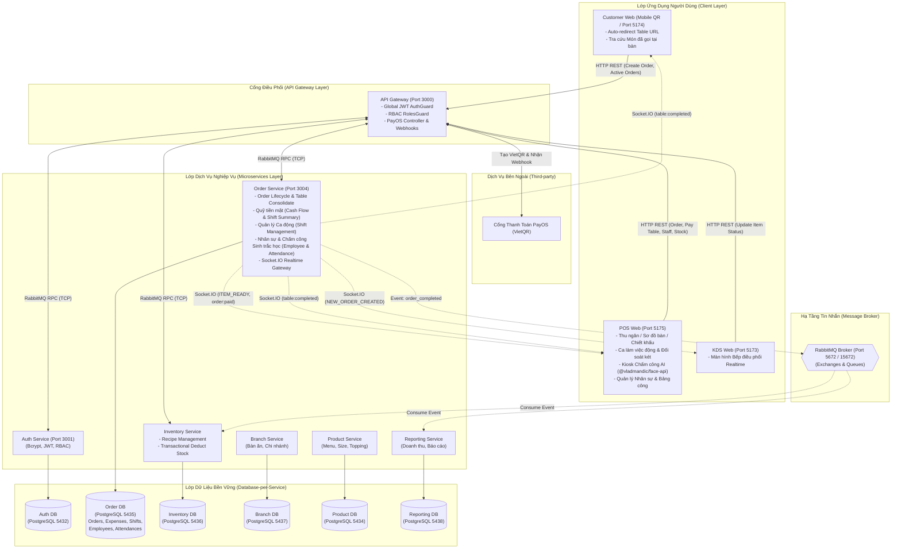
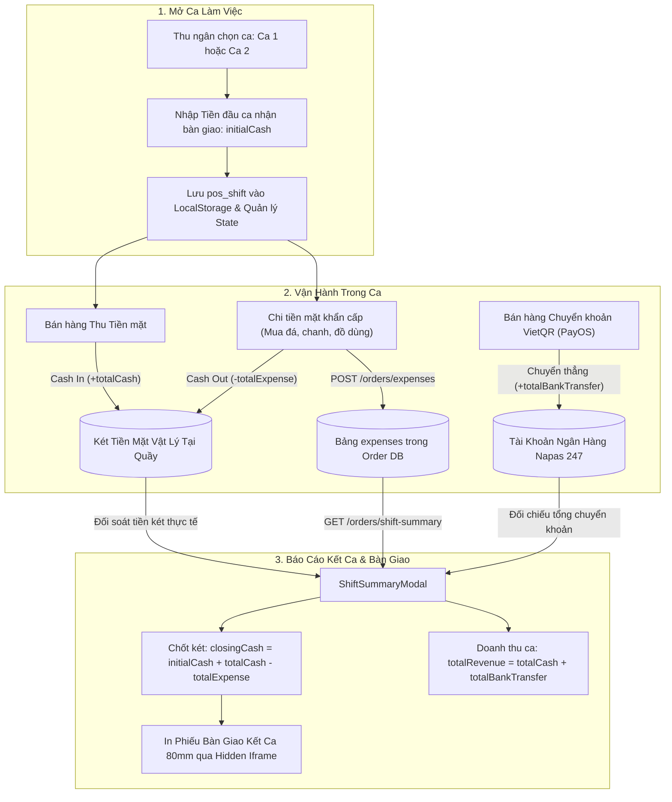
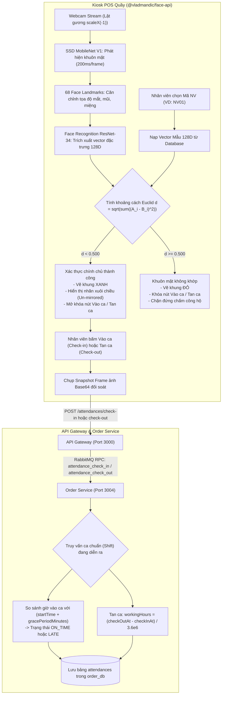

# Kiến Trúc Hệ Thống (System Architecture)

Hệ thống được thiết kế theo mô hình **Microservices Architecture** kết hợp **Event-Driven Architecture (EDA)** nhằm đảm bảo tính độc lập, khả năng mở rộng quy mô linh hoạt (scalability) và độ chịu lỗi cao cho chuỗi F&B đa chi nhánh.

---

## 1. Sơ đồ Kiến trúc Tổng thể (Overall System Architecture)

```mermaid
graph TB
    %% Client Layer
    subgraph Clients ["Lớp Ứng Dụng Người Dùng (Client Layer)"]
        CW["Customer Web (Mobile QR / Port 5174)<br/>- Auto-redirect Table URL<br/>- Tra cứu Món đã gọi tại bàn"]
        POS["POS Web (Port 5175)<br/>- Thu ngân / Sơ đồ bàn / Chiết khấu<br/>- Ca làm việc động & Đối soát két<br/>- Kiosk Chấm công AI (@vladmandic/face-api)<br/>- Quản lý Nhân sự & Bảng công"]
        KDS["KDS Web (Port 5173)<br/>- Màn hình Bếp điều phối Realtime"]
    end

    %% External Services
    subgraph External ["Dịch Vụ Bên Ngoài (Third-party)"]
        PayOS["Cổng Thanh Toán PayOS (VietQR)"]
    end

    %% API Gateway Layer
    subgraph Gateway ["Cổng Điều Phối (API Gateway Layer)"]
        GW["API Gateway (Port 3000)<br/>- Global JWT AuthGuard<br/>- RBAC RolesGuard<br/>- PayOS Controller & Webhooks"]
    end

    %% Message Broker
    subgraph Broker ["Hạ Tầng Tin Nhắn (Message Broker)"]
        RMQ{{"RabbitMQ Broker (Port 5672 / 15672)<br/>(Exchanges & Queues)"}}
    end

    %% Microservices Layer
    subgraph Services ["Lớp Dịch Vụ Nghiệp Vụ (Microservices Layer)"]
        AS["Auth Service (Port 3001)<br/>(Bcrypt, JWT, RBAC)"]
        OS["Order Service (Port 3004)<br/>- Order Lifecycle & Table Consolidate<br/>- Quỹ tiền mặt (Cash Flow & Shift Summary)<br/>- Quản lý Ca động (Shift Management)<br/>- Nhân sự & Chấm công Sinh trắc học (Employee & Attendance)<br/>- Socket.IO Realtime Gateway"]
        IS["Inventory Service<br/>- Recipe Management<br/>- Transactional Deduct Stock"]
        BS["Branch Service<br/>(Bàn ăn, Chi nhánh)"]
        PS["Product Service<br/>(Menu, Size, Topping)"]
        RS["Reporting Service<br/>(Doanh thu, Báo cáo)"]
    end

    %% Database Layer
    subgraph Databases ["Lớp Dữ Liệu Bền Vững (Database-per-Service)"]
        DB1[("Auth DB<br/>(PostgreSQL 5432)")]
        DB2[("Order DB<br/>(PostgreSQL 5435)<br/>Orders, Expenses, Shifts,<br/>Employees, Attendances")]
        DB3[("Inventory DB<br/>(PostgreSQL 5436)")]
        DB4[("Branch DB<br/>(PostgreSQL 5437)")]
        DB5[("Product DB<br/>(PostgreSQL 5434)")]
        DB6[("Reporting DB<br/>(PostgreSQL 5438)")]
    end

    %% Client Interactions
    CW -->|"HTTP REST (Create Order, Active Orders)"| GW
    POS -->|"HTTP REST (Order, Pay Table, Staff, Stock)"| GW
    KDS -->|"HTTP REST (Update Item Status)"| GW

    %% Realtime WebSocket
    OS -.->|"Socket.IO (NEW_ORDER_CREATED)"| KDS
    OS -.->|"Socket.IO (ITEM_READY, order:paid)"| POS
    OS -.->|"Socket.IO (table:completed)"| CW
    OS -.->|"Socket.IO (table:completed)"| POS

    %% External PayOS Integration
    GW <-->|"Tạo VietQR & Nhận Webhook"| PayOS

    %% Gateway to Microservices (RPC via RabbitMQ)
    GW <-->|"RabbitMQ RPC (TCP)"| AS
    GW <-->|"RabbitMQ RPC (TCP)"| OS
    GW <-->|"RabbitMQ RPC (TCP)"| IS

    %% Event Pub/Sub
    OS -.->|"Event: order_completed"| RMQ
    RMQ -.->|"Consume Event"| IS
    RMQ -.->|"Consume Event"| RS

    %% Database Connections
    AS --> DB1
    OS --> DB2
    IS --> DB3
    BS --> DB4
    PS --> DB5
    RS --> DB6
```

---

## 2. Database-per-Service Pattern & Persistent Storage

Hệ thống áp dụng triệt để nguyên lý **Database-per-Service**: mỗi Microservice quản lý toàn quyền một cơ sở dữ liệu PostgreSQL độc lập, ngăn chặn hoàn toàn việc join bảng xuyên service hay vi phạm tính đóng gói.

### Cơ chế Named Persistent Volumes trong Docker
Nhằm giải quyết triệt để rủi ro mất dữ liệu khi container bị dừng hoặc dựng lại (`docker compose down` / `docker compose up -d --build`), toàn bộ cơ sở dữ liệu và message broker được gắn với các **Named Volumes** bền vững tại `docker-compose.yml`:

| Dịch vụ Container | Cổng Host | Named Volume | Đường dẫn Mount trong Container | Thực thể chính (Core Entities) |
| :--- | :--- | :--- | :--- | :--- |
| `fnb_postgres_auth` | `5432` | `postgres_auth_data` | `/var/lib/postgresql/data` | `users` (credentials, roles, branchId) |
| `fnb_postgres_product`| `5434` | `postgres_product_data` | `/var/lib/postgresql/data` | `products`, `categories`, `product_sizes`, `toppings`, `branch_product_availabilities` |
| `fnb_postgres_order` | `5435` | `postgres_order_data` | `/var/lib/postgresql/data` | `orders`, `order_items`, `order_item_toppings`, `payments`, `expenses`, `shifts`, `employees` (face vectors 128D), `attendances` |
| `fnb_postgres_inventory`| `5436` | `postgres_inventory_data` | `/var/lib/postgresql/data` | `ingredients`, `branch_stocks`, `recipes`, `recipe_items`, `stock_transactions` |
| `fnb_postgres_branch` | `5437` | `postgres_branch_data` | `/var/lib/postgresql/data` | `branches`, `tables` |
| `fnb_postgres_reporting`| `5438` | `postgres_reporting_data` | `/var/lib/postgresql/data` | `daily_reports`, `revenue_summaries` |
| `fnb_rabbitmq` | `5672`, `15672`| `rabbitmq_data` | `/var/lib/rabbitmq` | Message queues, exchanges, bindings |

---

## 3. Kiến Trúc Hướng Sự Kiện & Tính Toàn Vẹn (Event-Driven & SAGA)

Nhằm tối ưu thời gian phản hồi cho các giao dịch tại quầy thu ngân (POS) và giảm độ trễ cho người dùng:
1. **Giao tiếp Bất đồng bộ (Pub/Sub):** Khi một đơn hàng hoàn tất thanh toán (`status = COMPLETED`), `order-service` phát sự kiện `order_completed` lên RabbitMQ exchange rồi trả về kết quả ngay cho POS mà không cần chờ kho phản hồi.
2. **Transaction Rollback tại Inventory Service:**
   - `inventory-service` nhận sự kiện `order_completed` và mở một **TypeORM Database Transaction** thông qua `QueryRunner`.
   - Với từng sản phẩm trong đơn, hệ thống tra cứu công thức định mức (`Recipe`) theo đúng `size` và `toppings`.
   - Nếu số lượng nguyên liệu trong kho đủ đáp ứng, hệ thống ghi nhận trừ kho (`quantity - required`) và chốt giao dịch (`commitTransaction`).
   - Nếu bất kỳ nguyên liệu nào không đủ tồn kho, toàn bộ giao dịch được hoàn tác tự động (`rollbackTransaction`) và phát cảnh báo kiểm kho, bảo vệ toàn vẹn dữ liệu. Cơ chế này đã được xác thực qua bộ Jest Unit Tests độc lập.

---

## 4. Socket.IO Realtime Gateway & Phân Tách Chi Nhánh (Room Isolation)

Order Service tổ chức một WebSocket Server độc lập lắng nghe tại cổng `3004`:
- **Room Isolation (`joinBranchRoom`):** Khi POS Web, KDS Web hoặc Customer Web khởi chạy, ứng dụng gửi sự kiện `joinBranchRoom(branchId)`. Socket Server sẽ đưa client vào room riêng biệt (ví dụ: `branch_1`, `branch_2`).
- **Phân phối sự kiện đúng địa chỉ:**
  - Đơn hàng mới từ QR bàn chi nhánh 1 chỉ kích hoạt thông báo trên màn hình KDS của chi nhánh 1 (`NEW_ORDER_CREATED`).
  - Món hoàn thành tại bếp chi nhánh 1 chỉ kích hoạt âm báo và Toast nổi trên POS của chi nhánh 1 (`ITEM_READY`).
  - Đơn hàng thanh toán thành công qua PayOS chỉ gửi tín hiệu `order:paid` tới quầy thu ngân của chi nhánh đó.
  - Khi thu ngân xác nhận thanh toán bàn tại POS, `order-service` phát sự kiện `table:completed` (kèm `branchId`, `tableId`, `orderId`) tới toàn room: Customer Web tại bàn đó lập tức đóng modal món đã gọi, xóa giỏ hàng và giải phóng bàn; đồng thời POS Web cập nhật sơ đồ bàn về trạng thái Bàn trống.

---

## 5. Mô Hình Bảo Mật: Stateless JWT & Phân Quyền Vai Trò (RBAC)

API Gateway đóng vai trò chốt chặn kiểm soát truy cập (Single Entry Guard):
1. **Xác thực Stateless JWT:** Mọi request (trừ các endpoint `@Public`) đều phải gửi kèm Header `Authorization: Bearer <token>`. Gateway ủy quyền giải mã token sang `auth-service` qua RabbitMQ pattern `{ cmd: 'validate_token' }`.
2. **Phân quyền dựa trên vai trò (RBAC RolesGuard):** Hệ thống phân định 5 nhóm vai trò cụ thể:
   - `ADMIN`: Toàn quyền quản trị hệ thống, chuỗi chi nhánh và tài khoản.
   - `MANAGER`: Quản lý kho, nhân sự và đơn hàng trong phạm vi chi nhánh phụ trách.
   - `CASHIER`: Thu ngân tại quầy POS, xử lý tạo đơn, chiết khấu và hoàn tất thanh toán.
   - `KITCHEN`: Nhân viên bếp thao tác cập nhật trạng thái món trên KDS Web.
   - `WAITER`: Nhân viên phục vụ hỗ trợ gọi món và chăm sóc khách tại bàn.
   - Nếu tài khoản không thuộc danh sách `@Roles(...)` được phép trên controller, Gateway trả về mã lỗi `403 Forbidden` ngay tức thì.

---

## 6. Cơ Chế Quản Lý Quỹ Tiền Mặt Vận Hành Tức Thời (Operational Cash Flow Architecture)

Nhằm đáp ứng yêu cầu kiểm soát tài chính minh bạch, ngăn chặn thất thoát tiền mặt và hỗ trợ quy trình bàn giao ca trực tiếp tại quầy thu ngân (POS Cash Drawer Handover), hệ thống triển khai kiến trúc dòng tiền vận hành (Operational Cash Flow) tức thời tại `order-service` và `pos-web`:

### 6.1. Sơ đồ Luân chuyển Dòng tiền tại Quầy (Cash In / Cash Out Flow)

```mermaid
flowchart TD
    subgraph ShiftStart ["1. Mở Ca Làm Việc"]
        SC["Thu ngân chọn ca: Ca 1 hoặc Ca 2"] --> IC["Nhập Tiền đầu ca nhận bàn giao: initialCash"]
        IC --> SS["Lưu pos_shift vào LocalStorage & Quản lý State"]
    end

    subgraph Operations ["2. Vận Hành Trong Ca"]
        SALE_CASH["Bán hàng Thu Tiền mặt"] -->|"Cash In (+totalCash)"| DRAWER[("Két Tiền Mặt Vật Lý Tại Quầy")]
        SALE_BANK["Bán hàng Chuyển khoản VietQR (PayOS)"] -->|"Chuyển thẳng (+totalBankTransfer)"| BANK[("Tài Khoản Ngân Hàng Napas 247")]
        EXP["Chi tiền mặt khẩn cấp (Mua đá, chanh, đồ dùng)"] -->|"Cash Out (-totalExpense)"| DRAWER
        EXP -->|"POST /orders/expenses"| EXP_DB[("Bảng expenses trong Order DB")]
    end

    subgraph ShiftClose ["3. Báo Cáo Kết Ca & Bàn Giao"]
        DRAWER -->|"Đối soát tiền két thực tế"| SUMMARY["ShiftSummaryModal"]
        EXP_DB -->|"GET /orders/shift-summary"| SUMMARY
        BANK -->|"Đối chiếu tổng chuyển khoản"| SUMMARY
        
        SUMMARY --> CALC["Chốt két: closingCash = initialCash + totalCash - totalExpense"]
        SUMMARY --> REV["Doanh thu ca: totalRevenue = totalCash + totalBankTransfer"]
        CALC --> PRINT["In Phiếu Bàn Giao Kết Ca 80mm qua Hidden Iframe"]
    end

    SS --> SALE_CASH
    SS --> EXP
```

### 6.2. Các Nguyên Tắc Nghiệp Vụ Tài Chính Cốt Lõi
1. **Tiền đầu ca nhận bàn giao (`initialCash` - Opening Cash):**
   - Thu ngân nhận két từ ca trước với lượng tiền mặt lẻ nhất định dùng để thối lại cho khách.
   - Số tiền này được nhập tại `ShiftSelectModal` qua bộ gõ Input Mask mượt mà và lưu vào phiên ca `pos_shift`.
2. **Tính độc lập giữa Doanh thu và Dòng tiền két (Sales Revenue vs. Cash Drawer Balance):**
   - **Doanh thu bán hàng ca trực:** $\text{totalRevenue} = \text{totalCash} + \text{totalBankTransfer}$. Doanh thu phản ánh đúng giá trị hàng hóa đã bán ra, tuyệt đối **không bị trừ** bởi các khoản chi tiêu vận hành.
   - **Tiền mặt trong két thực tế bàn giao:** $\text{closingCash} = \text{initialCash} + \text{totalCash} - \text{totalExpense}$. Khoản chi tiền mặt (`totalExpense`) là chi phí vận hành (OPEX), trực tiếp làm giảm lượng tiền mặt vật lý nằm trong két nhưng không làm giảm doanh số bán hàng.
3. **Quản lý Phiếu chi tiền mặt (`ExpenseModal.tsx` & `Expense` Entity):**
   - Mọi khoản trích tiền mặt từ két (mua đá cây, nước ngọt, phụ phẩm khẩn cấp) đều phải được tạo phiếu chi với lý do và người nhận rõ ràng.
   - Hỗ trợ in tức thời **Phiếu chi tiền mặt 80mm** (Cash Out Voucher) có đầy đủ chữ ký của Người nhận tiền và Người lập phiếu để kẹp vào két lưu trữ chứng từ đối soát.

### 6.3. Luồng Tương tác UI trên `pos-web`
1. **Nút Menu Tiện ích trên Header:**
   - Được thiết kế dưới dạng nút icon vuông bo góc (`w-10 h-10`), đặt ở bên trái nút **"Bán hàng"**.
   - Khi bấm sẽ mở Dropdown menu gom nhóm các tiện ích vận hành:
     - 📋 **Lịch sử đơn hàng:** Tự động lọc phạm vi đơn hàng phát sinh từ thời điểm `openedAt` của ca hiện tại.
     - 📊 **Báo cáo kết ca (`ShiftSummaryModal`):** Hiển thị các thẻ thống kê tài chính, thẻ Tiền chi trong ca (Màu Đỏ/Rose), bảng kê chi tiết các phiếu chi có nút In lại (Printer) và kích hoạt in Phiếu kết ca 80mm.
     - 💸 **Tạo phiếu chi tiền mặt (`ExpenseModal`):** Biểu mẫu tạo phiếu chi kèm in hóa đơn nhiệt 80mm.
     - Quản lý kho, Quản lý nhân viên (chỉ hiển thị cho tài khoản Quản lý/Admin).
2. **Kỹ thuật In nhiệt 80mm qua Hidden Iframe:**
   - Để tránh xung đột với các class ẩn của Single Page Application (`@media print { #root { display: none !important; } }`), các chức năng in (Phiếu chi, Phiếu kết ca) đều sử dụng một **thẻ iframe ẩn độc lập** được tạo động trong DOM, nạp HTML/CSS in nhiệt chuyên dụng khổ 80mm, kích hoạt lệnh `window.print()` và tự động hủy sau khi in xong. Giải pháp này đảm bảo tính ổn định tối đa trên mọi trình duyệt Chromium và máy in nhiệt POS thông dụng.

---

## 7. Kiến Trúc Quản Lý Nhân Sự & Chấm Công Sinh Trắc Học AI (Biometric Attendance Architecture)

Nhằm giải quyết triệt để vấn nạn chấm công hộ (buddy punching) và tự động hóa quy trình quản trị ca kíp tại quầy, hệ thống triển khai giải pháp thị giác máy tính Client-side AI kết hợp mô hình dữ liệu tập trung tại `order-service`.

### 7.1. Sơ đồ Luồng Kiosk Chấm công Sinh trắc học Thời gian thực

```mermaid
flowchart TD
    subgraph ClientPOS ["Kiosk POS Quầy (@vladmandic/face-api)"]
        CAM["Webcam Stream (Lật gương scaleX(-1))"] --> DETECT["SSD MobileNet V1: Phát hiện khuôn mặt (200ms/frame)"]
        DETECT --> LANDMARK["68 Face Landmarks: Căn chỉnh tọa độ mắt, mũi, miệng"]
        LANDMARK --> EMBED["Face Recognition ResNet-34: Trích xuất vector đặc trưng 128D"]
        
        STAFF_SEL["Nhân viên chọn Mã NV (VD: NV01)"] --> CACHE_VEC["Nạp Vector Mẫu 128D từ Database"]
        
        EMBED --> MATCH{"Tính khoảng cách Euclid d = sqrt(sum((A_i - B_i)^2))"}
        CACHE_VEC --> MATCH
        
        MATCH -->|"d < 0.500"| PASS["Xác thực chính chủ thành công<br/>- Vẽ khung XANH<br/>- Hiển thị nhãn xuôi chiều (Un-mirrored)<br/>- Mở khóa nút Vào ca / Tan ca"]
        MATCH -->|"d >= 0.500"| FAIL["Khuôn mặt không khớp<br/>- Vẽ khung ĐỎ<br/>- Khóa nút Vào ca / Tan ca<br/>- Chặn đứng chấm công hộ"]
        
        PASS --> ACTION["Nhân viên bấm Vào ca (Check-in) hoặc Tan ca (Check-out)"]
        ACTION --> CAPTURE["Chụp Snapshot Frame ảnh Base64 đối soát"]
    end

    subgraph BackendGateway ["API Gateway & Order Service"]
        CAPTURE -->|"POST /attendances/check-in hoặc check-out"| GW["API Gateway (Port 3000)"]
        GW -->|"RabbitMQ RPC: attendance_check_in / attendance_check_out"| OS["Order Service (Port 3004)"]
        
        OS --> CHECK_SHIFT{"Truy vấn ca chuẩn (Shift) đang diễn ra"}
        CHECK_SHIFT --> CALC_STATUS["So sánh giờ vào ca với (startTime + gracePeriodMinutes)<br/>-> Trạng thái ON_TIME hoặc LATE"]
        CHECK_SHIFT --> CALC_HOURS["Tan ca: workingHours = (checkOutAt - checkInAt) / 3.6e6"]
        
        CALC_STATUS --> SAVE_ATT[("Lưu bảng attendances trong order_db")]
        CALC_HOURS --> SAVE_ATT
    end
```

### 7.2. Vị trí Lưu trữ Vector Sinh trắc học & Snapshot Đối soát trong `order_db`
- **Vector khuôn mặt 128 chiều (`Employee.faceDescriptor`):**
  - Lưu trữ dưới dạng cột kiểu `jsonb` trong bảng `employees` của `order_db`.
  - Chứa đúng 128 số thực float tương ứng với biểu diễn toán học chuẩn của không gian Euclid từ ResNet-34.
  - Khi ứng dụng POS khởi động hoặc mở Kiosk, danh sách nhân viên cùng vector này được nạp vào bộ nhớ RAM của trình duyệt, cho phép so khớp 1:1 tức thời mà không cần gọi API tính toán lên server.
- **Snapshot ảnh chụp đối soát (`Attendance.checkInPhoto`, `Attendance.checkOutPhoto`):**
  - Chụp tự động ngay tại khoảnh khắc bấm nút Check-in/Check-out với độ phân giải nén vừa phải (Base64 JPEG).
  - Lưu trực tiếp vào cột `text` trong bảng `attendances`, phục vụ quản lý đối chiếu trực quan tại Tab "Bảng chấm công" của `TimesheetModal.tsx`.

### 7.3. Kỹ thuật Hiển thị Un-mirror Canvas trên Video Stream Lật gương
- **Vấn đề quang học:** Khi người dùng nhìn vào màn hình Kiosk chấm công, video camera bắt buộc phải lật gương (`transform: scaleX(-1)`) để hành vi chuyển động giống hệt khi soi gương. Tuy nhiên, nếu vẽ trực tiếp khung nhận diện và chữ (ví dụ: "✅ Xác thực chính chủ (65% khớp)") lên canvas cùng lớp biến đổi này, toàn bộ text sẽ bị lật ngược từ phải sang trái.
- **Giải pháp xử lý:**
  1. Giữ nguyên video element với class `-scale-x-100`.
  2. Canvas vẽ overlay được đặt đè lên video với kích thước pixel 1:1.
  3. Để khung viền và chữ bám sát mặt đã lật mà chữ vẫn đọc xuôi chiều:
     - Tọa độ $X$ của khung nhận diện được đảo ngược theo chiều rộng canvas:
       $$x_{\text{draw}} = \text{canvasWidth} - x_{\text{box}} - \text{width}_{\text{box}}$$
     - Nhãn văn bản (Text Label) được vẽ trực tiếp tại tọa độ $x_{\text{draw}}$ trên ngữ cảnh 2D không bị lật gương. Nhờ đó, khung viền di chuyển chuẩn xác theo cử động người dùng và các dòng trạng thái hiển thị rõ ràng, chuyên nghiệp.

### 7.4. Architectural Decision Record (ADR): Gộp Bảng `employees` và `attendances` vào `order_db`
* **Trạng thái:** ĐÃ PHÊ DUYỆT & TRIỂN KHAI.
* **Bối cảnh:** Cần quyết định nơi lưu trữ các thực thể quản lý nhân viên quầy (`Employee`), ca làm việc (`Shift`) và nhật ký chấm công (`Attendance`). Có 3 phương án được cân nhắc:
  1. *Phương án A:* Tách một service mới độc lập (`hr-service` với `hr_db`).
  2. *Phương án B:* Đưa vào `auth-service` / `auth_db`.
  3. *Phương án C (Được chọn):* Tích hợp vào `order-service` / `order_db` (Cơ sở dữ liệu vận hành quầy).
* **Lý do lựa chọn Phương án C:**
  1. **Tính trọn vẹn của Giao dịch Vận hành quầy (ACID Transactions):**
     - Tại quầy thu ngân, phiên ca làm việc (`pos_shift`), ca làm việc chuẩn (`Shift`), thu ngân lập phiếu (`cashierId`) và các hóa đơn bán hàng/phiếu chi tiền mặt có mối quan hệ phụ thuộc lẫn nhau rất chặt chẽ.
     - Khi xuất báo cáo kết ca (`ShiftSummaryModal`), hệ thống cần tính toán đồng bộ giữa giờ vào ca thực tế của thu ngân trong `attendances`, doanh số bán hàng và các phiếu chi phát sinh. Lưu chung trong `order_db` cho phép thực thi truy vấn SQL gộp tốc độ cao mà không cần đến Distributed Transactions (SAGA / 2PC).
  2. **Độ trễ thấp tối đa cho Kiosk Điểm danh quầy (< 50ms):**
     - Trạm Kiosk POS phục vụ cho toàn bộ nhân sự quầy đổi ca dồn dập vào giờ cao điểm. Việc gom chung vào `order-service` giúp giảm thiểu 1 bước RPC mạng phân tán, đảm bảo thao tác chấm công hoàn tất ngay lập tức.
  3. **Phân định ranh giới trách nhiệm (Bounded Context) rõ ràng:**
     - `auth-service` tập trung 100% vào việc xác thực bảo mật tài khoản hệ thống (User credentials, Bcrypt, JWT Token).
     - `order-service` đảm nhiệm toàn bộ thực thể "Vận hành Vật lý tại cửa hàng" (Physical Store Operations: Bàn ăn, Đơn hàng, Ca kíp, Nhân sự quầy, Chấm công, Quỹ tiền mặt).

