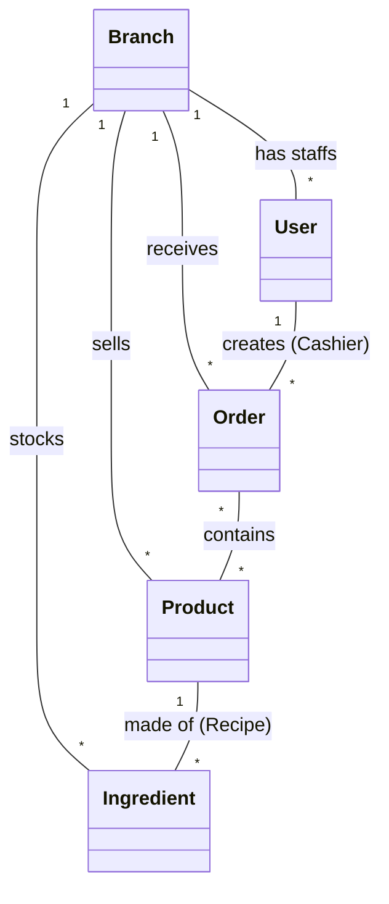
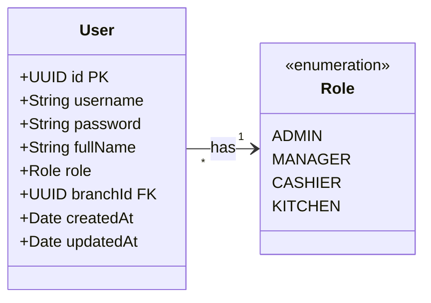
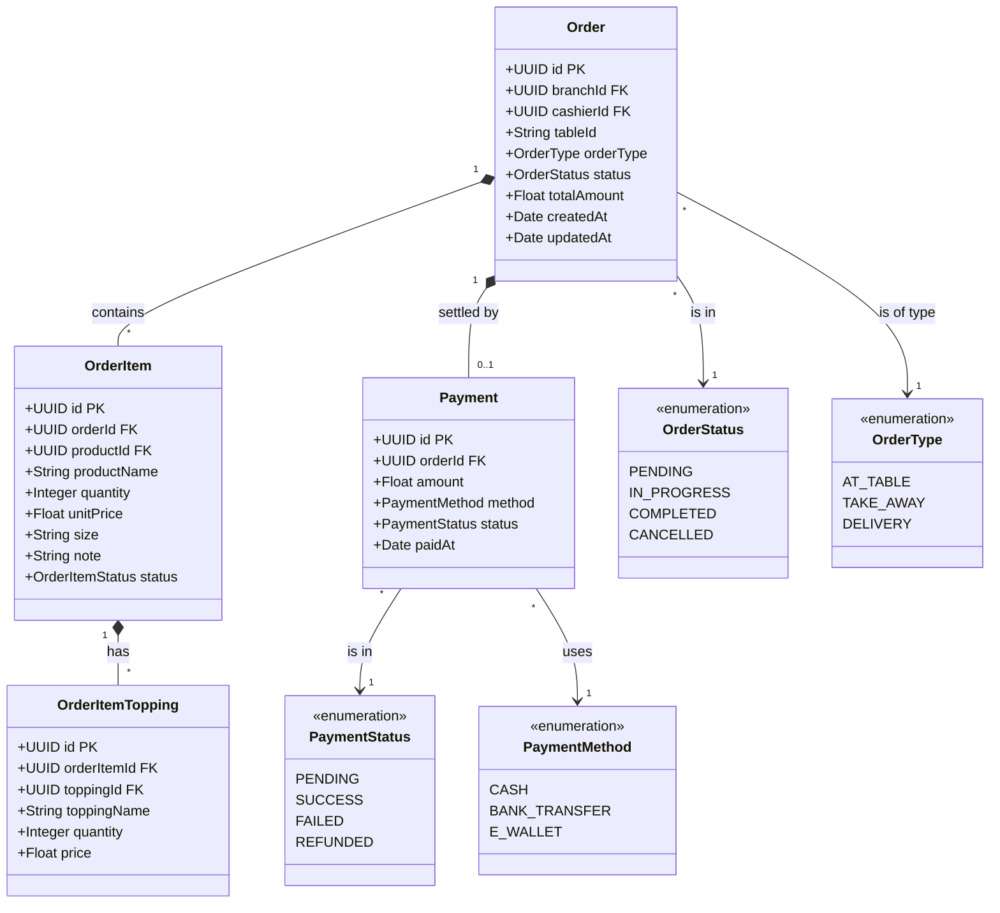
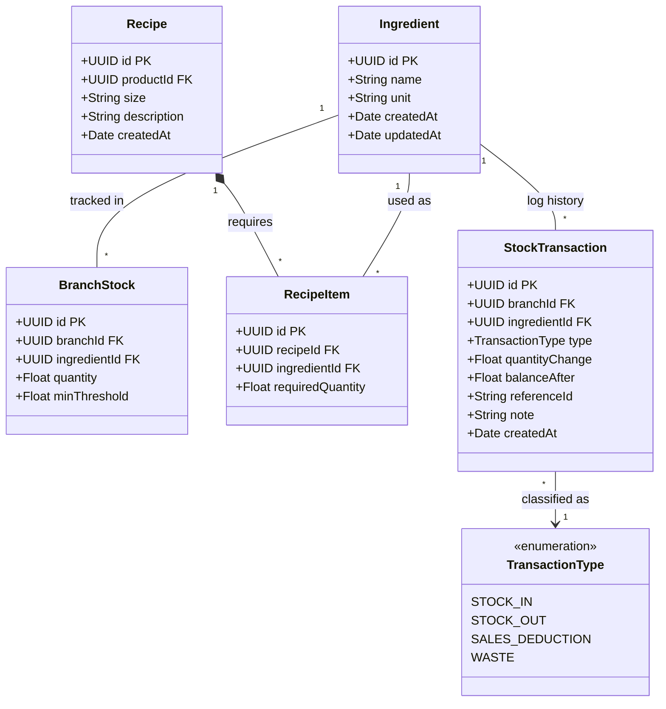
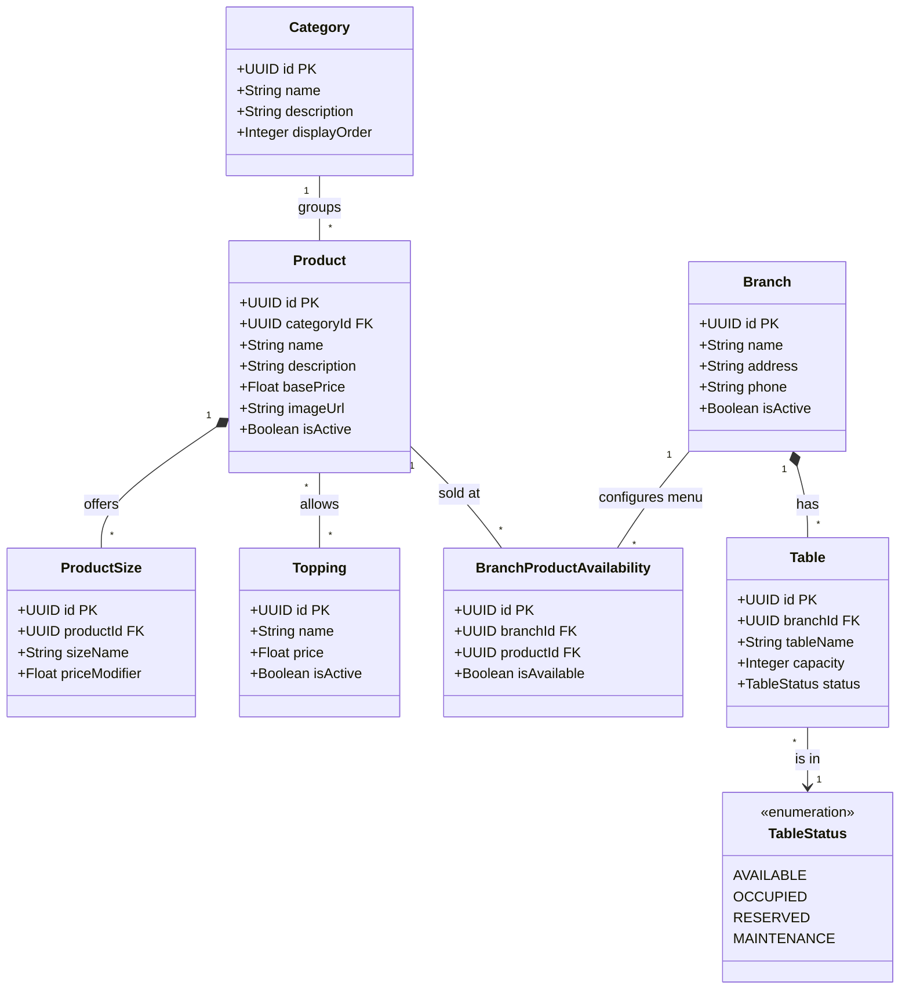

# Sơ đồ Lớp Hệ thống (Class Diagrams)

Tài liệu này cung cấp các sơ đồ lớp (Class Diagrams) chuẩn UML cho toàn bộ hệ thống Microservices Quản lý Bán hàng F&B. Các sơ đồ này thể hiện chi tiết cấu trúc thực thể, thuộc tính, và các mối quan hệ nhằm phục vụ cho Báo cáo Khóa luận Tốt nghiệp.

---

## 1. Sơ đồ Tổng quan toàn hệ thống (Domain Model Overview)

Sơ đồ dưới đây thể hiện bức tranh tổng quan về các thực thể cốt lõi trong hệ thống và mối quan hệ (ảo) giữa chúng xuyên suốt các Microservices. (Lưu ý: Trong thực tế Microservices, các tham chiếu chéo được lưu dưới dạng ID - Foreign Key mềm).

---

## 2. Sơ đồ Chi tiết theo Phân hệ (Detailed Diagrams)

### 2.1. Phân hệ Xác thực & Phân quyền (Auth Service)

Quản lý thông tin đăng nhập, nhân sự và phân quyền truy cập.

### 2.2. Phân hệ Bán hàng & Đơn hàng (Order Service)

Quản lý luồng xử lý đơn hàng, chi tiết món ăn trong đơn và trạng thái thanh toán.

### 2.3. Phân hệ Quản lý Kho & Công thức (Inventory Service)

Quản lý định mức nguyên vật liệu, cấu hình công thức pha chế và biến động xuất nhập kho.

### 2.4. Phân hệ Sản phẩm & Chi nhánh (Product & Branch Services)

Quản lý danh mục (Menu), tuỳ chọn Topping, Size và Cấu trúc cửa hàng.

---

## 3. Từ điển Dữ liệu và Giải nghĩa Thực thể (Data Dictionary)

Bảng dưới đây giải thích ngắn gọn vai trò của các thực thể cốt lõi, phục vụ cho việc giải trình trong Báo cáo Khóa luận:

| Phân hệ | Thực thể (Class) | Ý nghĩa / Vai trò trong Hệ thống |
| :--- | :--- | :--- |
| **Auth** | `User` | Đại diện cho tài khoản nhân sự (Quản lý, Thu ngân, Đầu bếp) truy cập vào hệ thống POS/KDS. |
| **Auth** | `Role` | Enum định nghĩa quyền hạn (RBAC). Xác định luồng dữ liệu người dùng được phép thao tác. |
| **Order** | `Order` | Thực thể trung tâm lưu trữ thông tin về một phiên giao dịch (Đơn hàng) của khách hàng. |
| **Order** | `OrderItem` | Chi tiết một sản phẩm cụ thể (kèm kích thước và ghi chú) nằm trong một `Order`. |
| **Order** | `Payment` | Giao dịch thanh toán tài chính cho một Đơn hàng, lưu trữ số tiền và phương thức (Tiền mặt/Chuyển khoản). |
| **Inventory**| `Ingredient` | Danh mục nguyên vật liệu thô (Trà, Sữa, Trân châu) dùng để pha chế. |
| **Inventory**| `BranchStock` | Quản lý số lượng tồn kho thực tế của từng nguyên liệu tại một Chi nhánh cụ thể. |
| **Inventory**| `Recipe` | Bộ công thức định lượng nguyên liệu cho một Sản phẩm (Ví dụ: Trà sữa Size L cần bao nhiêu ml sữa). |
| **Inventory**| `StockTransaction`| Sổ kho (Log). Ghi nhận mọi giao dịch tăng/giảm kho (Nhập hàng, Trừ kho do bán, Hủy hàng). |
| **Product** | `Product` | Hàng hóa/Thức uống được trưng bày lên Menu cho khách hàng lựa chọn (Customer QR, POS). |
| **Product** | `BranchProductAvailability` | Bảng cấu hình cho phép một chi nhánh được quyền Bật/Tắt (Hết hàng/Còn hàng) một Sản phẩm cục bộ. |
| **Branch** | `Branch` | Định nghĩa thông tin cơ sở hạ tầng của một Cửa hàng vật lý. |
| **Branch** | `Table` | Định nghĩa sơ đồ bàn ăn tại cửa hàng phục vụ cho mô hình Dine-in (Dùng tại quán). |
