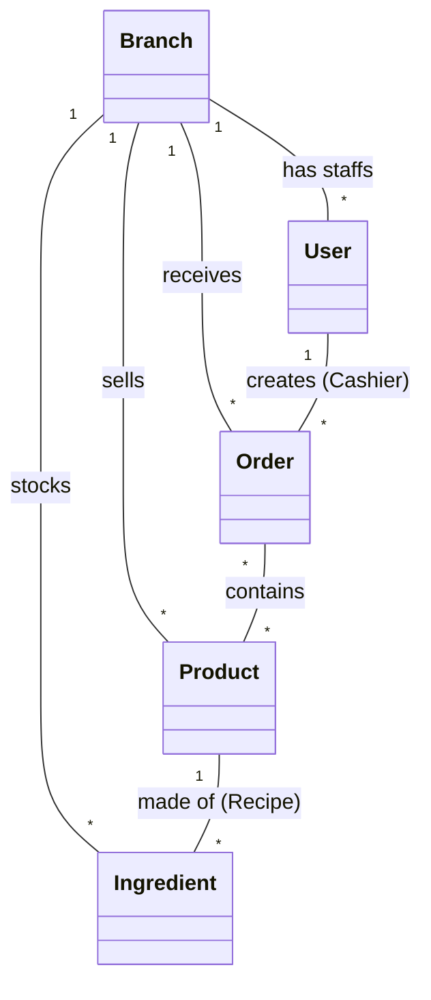
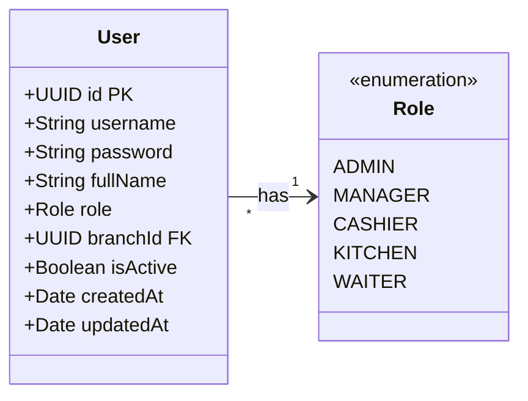
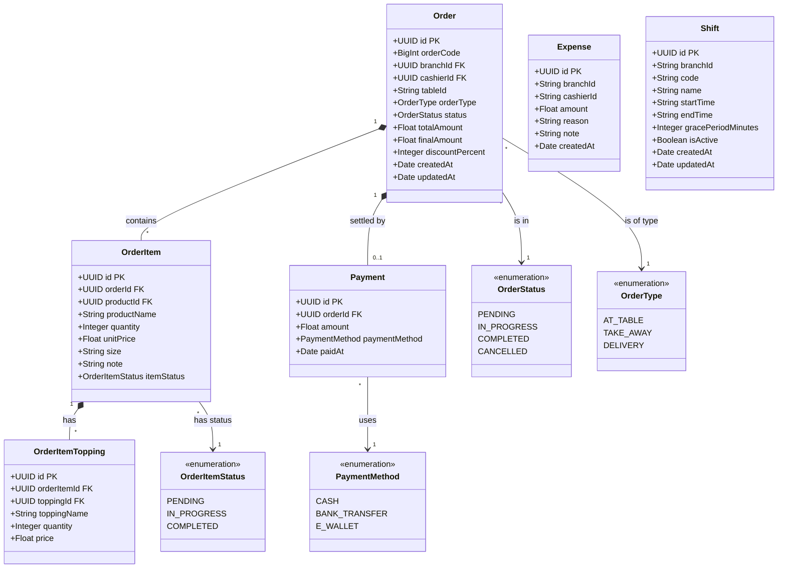
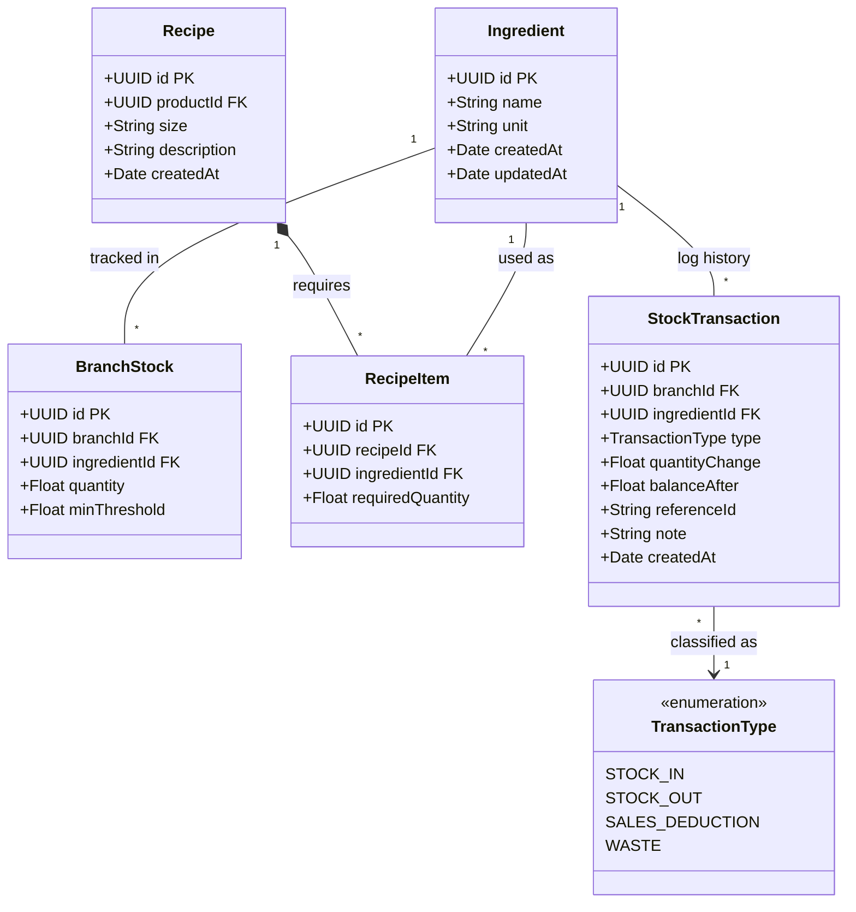
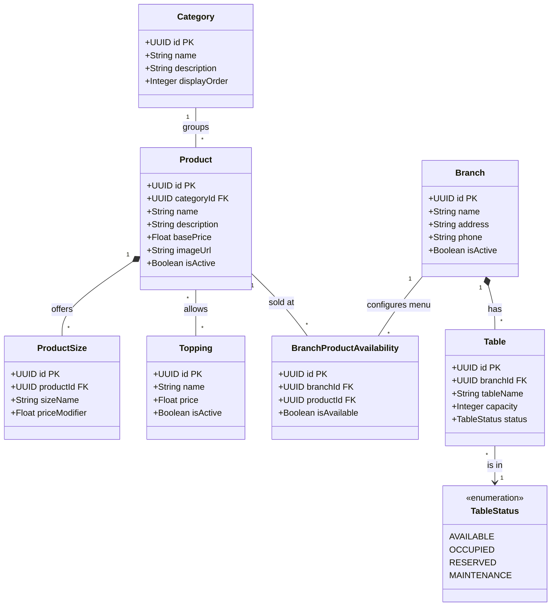

# Sơ đồ Lớp Hệ thống (Class Diagrams)

Tài liệu này cung cấp các sơ đồ lớp (Class Diagrams) chuẩn UML cho toàn bộ hệ thống Microservices Quản lý Bán hàng F&B. Các sơ đồ này thể hiện chi tiết cấu trúc thực thể TypeORM, thuộc tính, kiểu dữ liệu, các quan hệ (1-n, 1-1, n-n) và bảng từ điển dữ liệu phục vụ Báo cáo Khóa luận Tốt nghiệp.

---

## 1. Sơ đồ Miền Tổng thể Hệ thống (Domain Model Overview)

Sơ đồ thể hiện bức tranh tổng quan về các thực thể cốt lõi và mối quan hệ nghiệp vụ giữa chúng xuyên suốt các Microservices (các tham chiếu chéo service được lưu dưới dạng Foreign Key mềm qua chuỗi UUID/ID).

---

## 2. Sơ đồ Chi tiết theo Từng Phân hệ Microservice

### 2.1. Phân hệ Xác thực & Phân quyền (Auth Service)

Quản lý hồ sơ nhân viên, mật khẩu đã mã hóa và quyền hạn theo mô hình RBAC.

---

### 2.2. Phân hệ Bán hàng & Đơn hàng (Order Service)

Quản lý toàn bộ vòng đời đơn hàng, các món ăn kèm tuỳ chọn kích cỡ (Size), Topping, chiết khấu và giao dịch thanh toán.

> [!NOTE]
> **Chuẩn hóa Kiểu Dữ liệu Số (`columnNumericTransformer`):**
> Các cột lưu trữ số tiền (như `totalAmount`, `finalAmount` trong `Order`, `unitPrice` trong `OrderItem`, `price` trong `OrderItemTopping`, `amount` trong `Payment`, và `amount` trong `Expense`) được cấu hình TypeORM `decimal` kèm bộ chuyển đổi `columnNumericTransformer`. Bộ chuyển đổi này tự động parse chuỗi số thập phân từ PostgreSQL thành kiểu số thực JavaScript `number`, ngăn chặn lỗi hiển thị chuỗi dư `.00` (ví dụ: `"40000.00"` -> `40000`) khi truyền về Client.

---

### 2.3. Phân hệ Quản lý Kho & Định mức Công thức (Inventory Service)

Quản lý danh mục nguyên vật liệu thô, định mức tồn kho chi nhánh, công thức cấu thành sản phẩm và biến động xuất nhập tồn.

---

### 2.4. Phân hệ Sản phẩm & Sơ đồ Bàn (Product & Branch Services)

Quản lý danh mục thực đơn, tuỳ biến kích cỡ, Topping, tính khả dụng theo từng chi nhánh và sơ đồ bàn ăn phục vụ khách tại quán.

---

## 3. Từ điển Dữ liệu & Ý nghĩa Thực thể (Data Dictionary)

| Phân hệ | Thực thể (Class) | Ý nghĩa / Vai trò trong Hệ thống |
| :--- | :--- | :--- |
| **Auth** | `User` | Tài khoản nhân sự đăng nhập vào hệ thống POS / KDS. Thuộc về một chi nhánh và có một vai trò cụ thể. |
| **Auth** | `Role` | Enum định nghĩa vai trò RBAC: `ADMIN` (Quản trị viên), `MANAGER` (Quản lý chi nhánh), `CASHIER` (Thu ngân), `KITCHEN` (Đầu bếp), `WAITER` (Nhân viên phục vụ bàn). |
| **Order** | `Order` | Thực thể đơn hàng cốt lõi. Chứa thông tin tổng tiền tạm tính (`totalAmount`), số tiền thực thu sau chiết khấu (`finalAmount`), tỷ lệ chiết khấu (`discountPercent`), bàn số (`tableId`), thu ngân phụ trách (`cashierId`) và trạng thái đơn (`status`). |
| **Order** | `OrderItem` | Chi tiết món ăn trong đơn, kích cỡ (Size), số lượng, đơn giá và ghi chú riêng của khách hàng. Có trạng thái chế biến riêng (`itemStatus`). |
| **Order** | `OrderItemTopping` | Các món thêm (trân châu, thạch, phô mai...) gắn kèm với một món ăn cụ thể trong đơn. |
| **Order** | `Payment` | Giao dịch tài chính gắn với đơn hàng. Lưu trữ phương thức thanh toán (`CASH`, `BANK_TRANSFER`), số tiền khách trả và thời điểm hoàn tất. |
| **Order** | `Expense` | Phiếu chi tiền mặt phát sinh tại két thu ngân trong ca (mua đá cây, nguyên vật liệu tươi đột xuất, vật phẩm sửa chữa nhỏ). Chứa `amount`, `reason`, `note`, `cashierId`, `branchId` và thời điểm chi `createdAt`. |
| **Order** | `Shift` | Cấu hình khung giờ ca làm việc chuẩn tại hệ thống/chi nhánh (`code`, `name`, `startTime`, `endTime`, `gracePeriodMinutes`, `isActive`). Cung cấp dữ liệu ca động cho thu ngân mở ca và đối soát báo cáo kết ca. |
| **Inventory**| `Ingredient` | Danh mục nguyên vật liệu thô (Trà, sữa tươi, hạt cà phê, đường, bột kem béo...). |
| **Inventory**| `BranchStock` | Quản lý khối lượng tồn kho thực tế của nguyên liệu tại từng chi nhánh cùng mức tồn kho an toàn (`minThreshold`). |
| **Inventory**| `Recipe` | Bộ định lượng công thức pha chế cho từng món ăn tương ứng theo từng kích thước (Size). |
| **Inventory**| `StockTransaction`| Sổ cái ghi log biến động kho (Nhập hàng, Tự động trừ kho khi đơn bán hoàn tất, Xuất kho hủy hỏng). |
| **Product** | `Product` | Món ăn hoặc đồ uống trưng bày trên thực đơn điện tử (Menu). |
| **Product** | `BranchProductAvailability` | Bảng cấu hình tính sẵn có của món ăn tại chi nhánh (cho phép chi nhánh tạm tắt món khi hết nguyên liệu). |
| **Branch** | `Branch` | Định nghĩa chi nhánh cửa hàng vật lý trong chuỗi F&B. |
| **Branch** | `Table` | Định nghĩa bàn ăn trong sơ đồ nhà hàng phục vụ mô hình dùng bữa tại bàn (Dine-in). |
