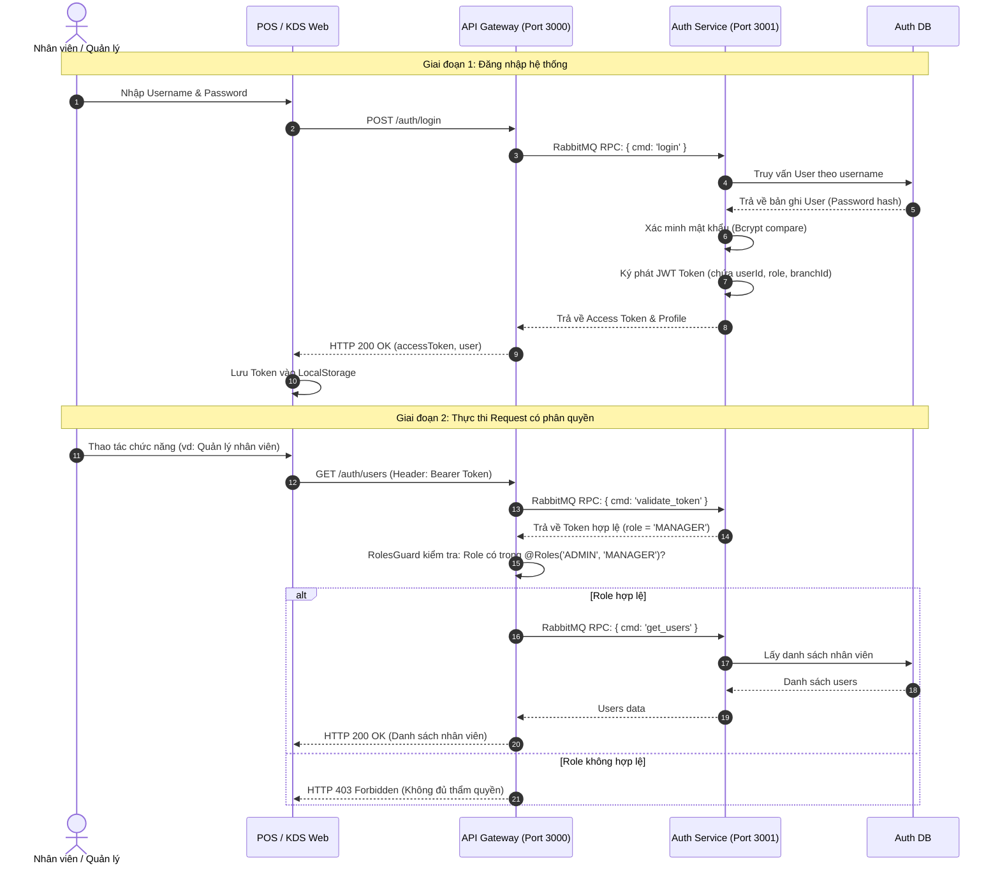
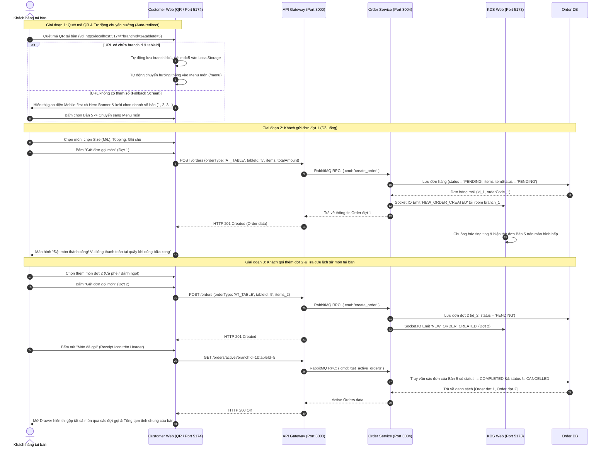
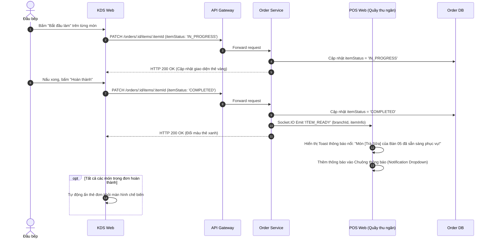
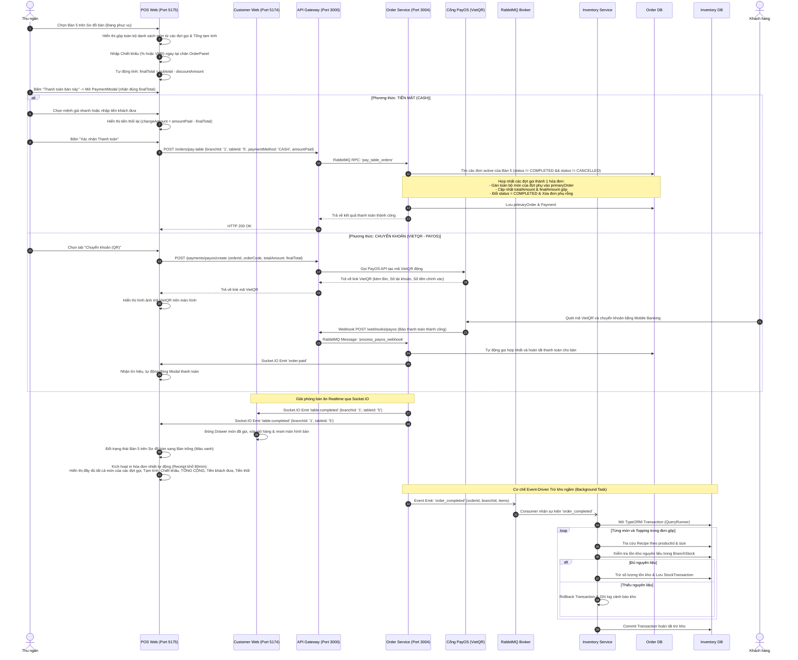

# Luồng Nghiệp Vụ Đầu-Cuối (End-to-End Workflows)

Tài liệu này cung cấp các sơ đồ tuần tự (Sequence Diagrams) chuẩn Mermaid và phân tích chi tiết các luồng nghiệp vụ cốt lõi trong hệ thống F&B Multi-branch.

---

## 1. Luồng Xác thực & Kiểm soát Phân quyền (Authentication & RBAC Guard)

Đảm bảo an toàn thông tin với kiến trúc Stateless JWT kết hợp kiểm soát phân quyền dựa trên vai trò (Role-Based Access Control) tại API Gateway.

---

## 2. Luồng Khách Đặt Món Tại Bàn (Dine-in Post-pay) & Tự Động Nhận Diện Bàn (Auto-redirect)

Khách hàng quét mã QR tại bàn ăn để gọi món theo mô hình **Thanh toán sau tại quầy (Post-pay)**. Hệ thống hỗ trợ tự động nhận diện bàn qua URL, gọi nhiều đợt trong bữa ăn và tra cứu danh sách món đã gọi theo thời gian thực.

---

## 3. Luồng Chế Biến Tại Bếp & Thông Báo Món Hoàn Thành (KDS -> POS)

Đầu bếp quản lý tiến độ thực đơn qua KDS. Khi món ăn hoàn thành, hệ thống gửi thông báo Realtime lên màn hình Thu ngân tại quầy POS.

---

## 4. Luồng Chiết Khấu, Thanh Toán Bàn Tại Quầy POS & Trừ Kho Bất Đồng Bộ (SAGA)

Thu ngân tiếp nhận yêu cầu thanh toán của khách, xem toàn bộ món gộp từ các đợt gọi, áp dụng chiết khấu, thu tiền (Tiền mặt hoặc VietQR PayOS), in hóa đơn gộp chuẩn xác, phát tín hiệu giải phóng bàn theo thời gian thực và kích hoạt trừ kho ngầm qua RabbitMQ.

