# Luồng Nghiệp Vụ Đầu-Cuối (End-to-End Workflows)

Tài liệu này cung cấp các sơ đồ tuần tự (Sequence Diagrams) chuẩn Mermaid và phân tích chi tiết các luồng nghiệp vụ cốt lõi trong hệ thống F&B Multi-branch.

---

## 1. Luồng Xác thực & Kiểm soát Phân quyền (Authentication & RBAC Guard)

Đảm bảo an toàn thông tin với kiến trúc Stateless JWT kết hợp kiểm soát phân quyền dựa trên vai trò (Role-Based Access Control) tại API Gateway.

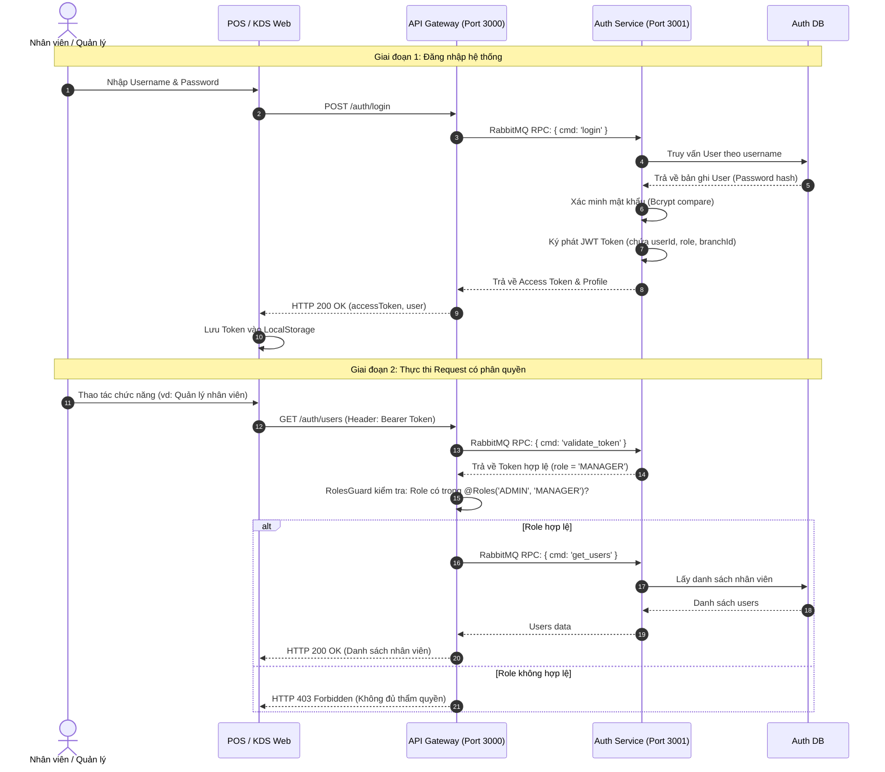
```mermaid
sequenceDiagram
    autonumber
    actor User as Nhân viên / Quản lý
    participant Client as POS / KDS Web
    participant GW as API Gateway (Port 3000)
    participant AS as Auth Service (Port 3001)
    participant DB as Auth DB

    %% Đăng nhập
    Note over User, DB: Giai đoạn 1: Đăng nhập hệ thống
    User->>Client: Nhập Username & Password
    Client->>GW: POST /auth/login
    GW->>AS: RabbitMQ RPC: { cmd: 'login' }
    AS->>DB: Truy vấn User theo username
    DB-->>AS: Trả về bản ghi User (Password hash)
    AS->>AS: Xác minh mật khẩu (Bcrypt compare)
    AS->>AS: Ký phát JWT Token (chứa userId, role, branchId)
    AS-->>GW: Trả về Access Token & Profile
    GW-->>Client: HTTP 200 OK (accessToken, user)
    Client->>Client: Lưu Token vào LocalStorage

    %% Thực thi Request có bảo vệ
    Note over User, DB: Giai đoạn 2: Thực thi Request có phân quyền
    User->>Client: Thao tác chức năng (vd: Quản lý nhân viên)
    Client->>GW: GET /auth/users (Header: Bearer Token)
    GW->>AS: RabbitMQ RPC: { cmd: 'validate_token' }
    AS-->>GW: Trả về Token hợp lệ (role = 'MANAGER')
    GW->>GW: RolesGuard kiểm tra: Role có trong @Roles('ADMIN', 'MANAGER')?
    alt Role hợp lệ
        GW->>AS: RabbitMQ RPC: { cmd: 'get_users' }
        AS->>DB: Lấy danh sách nhân viên
        DB-->>AS: Danh sách users
        AS-->>GW: Users data
        GW-->>Client: HTTP 200 OK (Danh sách nhân viên)
    else Role không hợp lệ
        GW-->>Client: HTTP 403 Forbidden (Không đủ thẩm quyền)
    end
```

---

## 2. Luồng Khách Đặt Món Tại Bàn (Dine-in Post-pay) & Tự Động Nhận Diện Bàn (Auto-redirect)

Khách hàng quét mã QR tại bàn ăn để gọi món theo mô hình **Thanh toán sau tại quầy (Post-pay)**. Hệ thống hỗ trợ tự động nhận diện bàn qua URL, gọi nhiều đợt trong bữa ăn và tra cứu danh sách món đã gọi theo thời gian thực.

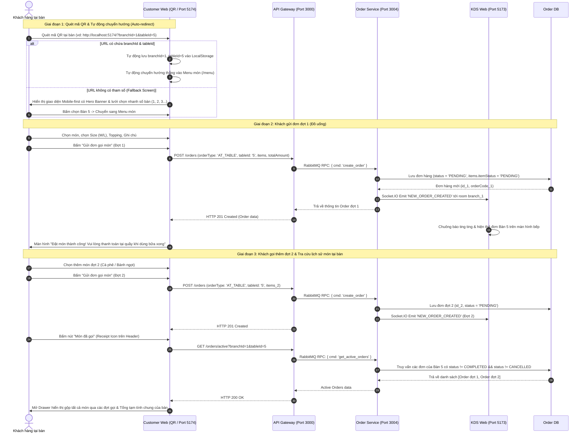
```mermaid
sequenceDiagram
    autonumber
    actor Customer as Khách hàng tại bàn
    participant Mobile as Customer Web (QR / Port 5174)
    participant GW as API Gateway (Port 3000)
    participant OS as Order Service (Port 3004)
    participant KDS as KDS Web (Port 5173)
    participant DB as Order DB

    %% Giai đoạn 1: Quét QR & Tự động nhận diện bàn
    Note over Customer, Mobile: Giai đoạn 1: Quét mã QR & Tự động chuyển hướng (Auto-redirect)
    Customer->>Mobile: Quét mã QR tại bàn (vd: http://localhost:5174/?branchId=1&tableId=5)
    alt URL có chứa branchId & tableId
        Mobile->>Mobile: Tự động lưu branchId=1, tableId=5 vào LocalStorage
        Mobile->>Mobile: Tự động chuyển hướng thẳng vào Menu món (/menu)
    else URL không có tham số (Fallback Screen)
        Mobile->>Customer: Hiển thị giao diện Mobile-first có Hero Banner & lưới chọn nhanh số bàn (1, 2, 3...)
        Customer->>Mobile: Bấm chọn Bàn 5 -> Chuyển sang Menu món
    end

    %% Giai đoạn 2: Gọi món đợt 1
    Note over Customer, DB: Giai đoạn 2: Khách gửi đơn đợt 1 (Đồ uống)
    Customer->>Mobile: Chọn món, chọn Size (M/L), Topping, Ghi chú
    Customer->>Mobile: Bấm "Gửi đơn gọi món" (Đợt 1)
    Mobile->>GW: POST /orders (orderType: 'AT_TABLE', tableId: '5', items, totalAmount)
    GW->>OS: RabbitMQ RPC: { cmd: 'create_order' }
    OS->>DB: Lưu đơn hàng (status = 'PENDING', items.itemStatus = 'PENDING')
    DB-->>OS: Đơn hàng mới (id_1, orderCode_1)
    OS->>KDS: Socket.IO Emit 'NEW_ORDER_CREATED' tới room branch_1
    OS-->>GW: Trả về thông tin Order đợt 1
    GW-->>Mobile: HTTP 201 Created (Order data)
    KDS->>KDS: Chuông báo ting ting & hiện thẻ đơn Bàn 5 trên màn hình bếp
    Mobile->>Customer: Màn hình "Đặt món thành công! Vui lòng thanh toán tại quầy khi dùng bữa xong"

    %% Giai đoạn 3: Gọi món đợt 2 & Tra cứu món đã gọi
    Note over Customer, DB: Giai đoạn 3: Khách gọi thêm đợt 2 & Tra cứu lịch sử món tại bàn
    Customer->>Mobile: Chọn thêm món đợt 2 (Cà phê / Bánh ngọt)
    Customer->>Mobile: Bấm "Gửi đơn gọi món" (Đợt 2)
    Mobile->>GW: POST /orders (orderType: 'AT_TABLE', tableId: '5', items_2)
    GW->>OS: RabbitMQ RPC: { cmd: 'create_order' }
    OS->>DB: Lưu đơn đợt 2 (id_2, status = 'PENDING')
    OS->>KDS: Socket.IO Emit 'NEW_ORDER_CREATED' (Đợt 2)
    GW-->>Mobile: HTTP 201 Created
    
    Customer->>Mobile: Bấm nút "Món đã gọi" (Receipt Icon trên Header)
    Mobile->>GW: GET /orders/active?branchId=1&tableId=5
    GW->>OS: RabbitMQ RPC: { cmd: 'get_active_orders' }
    OS->>DB: Truy vấn các đơn của Bàn 5 có status != COMPLETED && status != CANCELLED
    DB-->>OS: Trả về danh sách [Order đợt 1, Order đợt 2]
    OS-->>GW: Active Orders data
    GW-->>Mobile: HTTP 200 OK
    Mobile->>Customer: Mở Drawer hiển thị gộp tất cả món qua các đợt gọi & Tổng tạm tính chung của bàn
```

---

## 3. Luồng Chế Biến Tại Bếp & Thông Báo Món Hoàn Thành (KDS -> POS)

Đầu bếp quản lý tiến độ thực đơn qua KDS. Khi món ăn hoàn thành, hệ thống gửi thông báo Realtime lên màn hình Thu ngân tại quầy POS.

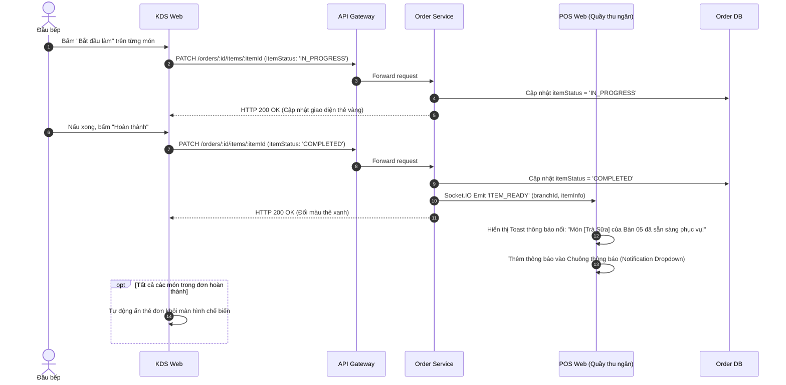
```mermaid
sequenceDiagram
    autonumber
    actor Chef as Đầu bếp
    participant KDS as KDS Web
    participant GW as API Gateway
    participant OS as Order Service
    participant POS as POS Web (Quầy thu ngân)
    participant DB as Order DB

    Chef->>KDS: Bấm "Bắt đầu làm" trên từng món
    KDS->>GW: PATCH /orders/:id/items/:itemId (itemStatus: 'IN_PROGRESS')
    GW->>OS: Forward request
    OS->>DB: Cập nhật itemStatus = 'IN_PROGRESS'
    OS-->>KDS: HTTP 200 OK (Cập nhật giao diện thẻ vàng)

    Chef->>KDS: Nấu xong, bấm "Hoàn thành"
    KDS->>GW: PATCH /orders/:id/items/:itemId (itemStatus: 'COMPLETED')
    GW->>OS: Forward request
    OS->>DB: Cập nhật itemStatus = 'COMPLETED'
    
    %% Realtime notify POS
    OS->>POS: Socket.IO Emit 'ITEM_READY' (branchId, itemInfo)
    OS-->>KDS: HTTP 200 OK (Đổi màu thẻ xanh)
    
    POS->>POS: Hiển thị Toast thông báo nổi: "Món [Trà Sữa] của Bàn 05 đã sẵn sàng phục vụ!"
    POS->>POS: Thêm thông báo vào Chuông thông báo (Notification Dropdown)
    
    opt Tất cả các món trong đơn hoàn thành
        KDS->>KDS: Tự động ẩn thẻ đơn khỏi màn hình chế biến
    end
```

---

## 4. Luồng Chiết Khấu, Thanh Toán Bàn Tại Quầy POS & Trừ Kho Bất Đồng Bộ (SAGA)

Thu ngân tiếp nhận yêu cầu thanh toán của khách, xem toàn bộ món gộp từ các đợt gọi, áp dụng chiết khấu, thu tiền (Tiền mặt hoặc VietQR PayOS), in hóa đơn gộp chuẩn xác, phát tín hiệu giải phóng bàn theo thời gian thực và kích hoạt trừ kho ngầm qua RabbitMQ.

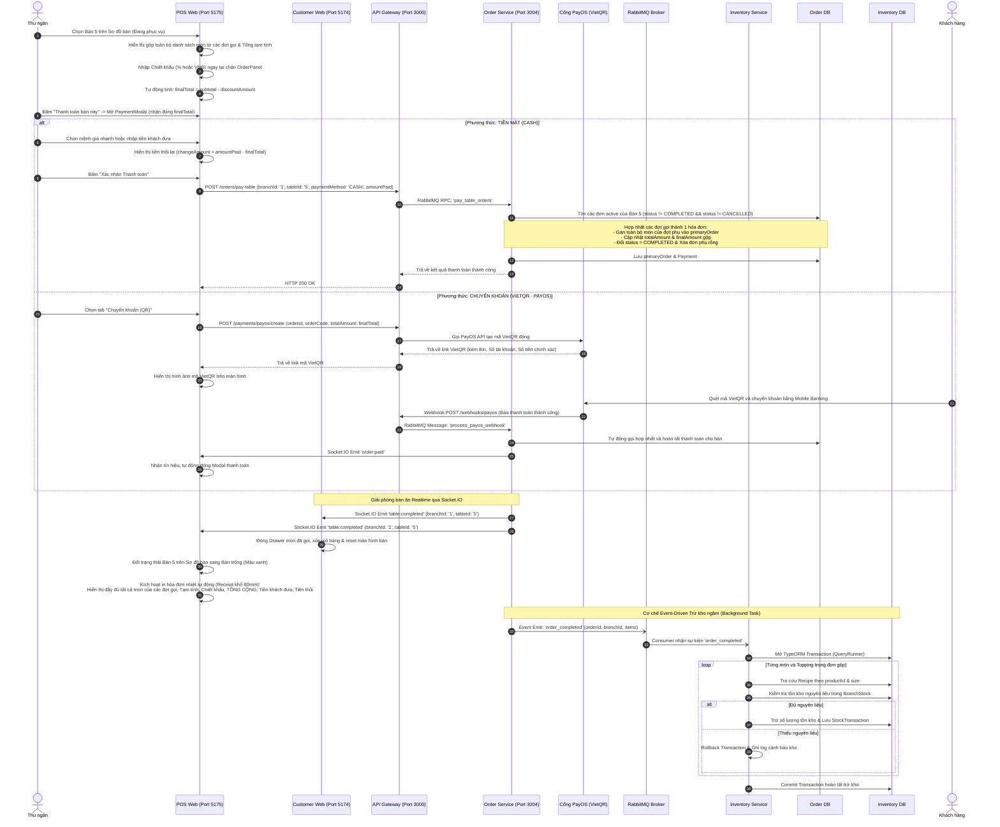
```mermaid
sequenceDiagram
    autonumber
    actor Cashier as Thu ngân
    participant POS as POS Web (Port 5175)
    participant CW as Customer Web (Port 5174)
    participant GW as API Gateway (Port 3000)
    participant OS as Order Service (Port 3004)
    participant PayOS as Cổng PayOS (VietQR)
    participant RMQ as RabbitMQ Broker
    participant IS as Inventory Service
    participant DB_O as Order DB
    participant DB_I as Inventory DB

    Cashier->>POS: Chọn Bàn 5 trên Sơ đồ bàn (Đang phục vụ)
    POS->>POS: Hiển thị gộp toàn bộ danh sách món từ các đợt gọi & Tổng tạm tính
    POS->>POS: Nhập Chiết khấu (% hoặc VNĐ) ngay tại chân OrderPanel
    POS->>POS: Tự động tính: finalTotal = subtotal - discountAmount
    Cashier->>POS: Bấm "Thanh toán bàn này" -> Mở PaymentModal (nhận đúng finalTotal)

    alt Phương thức: TIỀN MẶT (CASH)
        Cashier->>POS: Chọn mệnh giá nhanh hoặc nhập tiền khách đưa
        POS->>POS: Hiển thị tiền thối lại (changeAmount = amountPaid - finalTotal)
        Cashier->>POS: Bấm "Xác nhận Thanh toán"
        POS->>GW: POST /orders/pay-table (branchId: '1', tableId: '5', paymentMethod: 'CASH', amountPaid)
        GW->>OS: RabbitMQ RPC: 'pay_table_orders'
        OS->>DB_O: Tìm các đơn active của Bàn 5 (status != COMPLETED && status != CANCELLED)
        Note over OS, DB_O: Hợp nhất các đợt gọi thành 1 hóa đơn:<br/>- Gán toàn bộ món của đợt phụ vào primaryOrder<br/>- Cập nhật totalAmount & finalAmount gộp<br/>- Đổi status = COMPLETED & Xóa đơn phụ rỗng
        OS->>DB_O: Lưu primaryOrder & Payment
        OS-->>GW: Trả về kết quả thanh toán thành công
        GW-->>POS: HTTP 200 OK
    else Phương thức: CHUYỂN KHOẢN (VIETQR - PAYOS)
        Cashier->>POS: Chọn tab "Chuyển khoản (QR)"
        POS->>GW: POST /payments/payos/create (orderId, orderCode, totalAmount: finalTotal)
        GW->>PayOS: Gọi PayOS API tạo mã VietQR động
        PayOS-->>GW: Trả về link VietQR (kèm Bin, Số tài khoản, Số tiền chính xác)
        GW-->>POS: Trả về link mã VietQR
        POS->>POS: Hiển thị hình ảnh mã VietQR trên màn hình
        
        actor Customer as Khách hàng
        Customer->>PayOS: Quét mã VietQR và chuyển khoản bằng Mobile Banking
        PayOS->>GW: Webhook POST /webhooks/payos (Báo thanh toán thành công)
        GW->>OS: RabbitMQ Message: 'process_payos_webhook'
        OS->>DB_O: Tự động gọi hợp nhất và hoàn tất thanh toán cho bàn
        OS->>POS: Socket.IO Emit 'order:paid'
        POS->>POS: Nhận tín hiệu, tự động đóng Modal thanh toán
    end

    %% Giải phóng bàn Realtime
    Note over OS, CW: Giải phóng bàn ăn Realtime qua Socket.IO
    OS->>CW: Socket.IO Emit 'table:completed' (branchId: '1', tableId: '5')
    OS->>POS: Socket.IO Emit 'table:completed' (branchId: '1', tableId: '5')
    CW->>CW: Đóng Drawer món đã gọi, xóa giỏ hàng & reset màn hình bàn
    POS->>POS: Đổi trạng thái Bàn 5 trên Sơ đồ bàn sang Bàn trống (Màu xanh)

    %% In hóa đơn
    POS->>POS: Kích hoạt in hóa đơn nhiệt tự động (Receipt khổ 80mm):<br/>Hiển thị đầy đủ tất cả món của các đợt gọi, Tạm tính, Chiết khấu, TỔNG CỘNG, Tiền khách đưa, Tiền thối

    %% Trừ kho bất đồng bộ SAGA
    Note over OS, DB_I: Cơ chế Event-Driven Trừ kho ngầm (Background Task)
    OS-)RMQ: Event Emit: 'order_completed' (orderId, branchId, items)
    RMQ-)IS: Consumer nhận sự kiện 'order_completed'
    IS->>DB_I: Mở TypeORM Transaction (QueryRunner)
    loop Từng món và Topping trong đơn gộp
        IS->>DB_I: Tra cứu Recipe theo productId & size
        IS->>DB_I: Kiểm tra tồn kho nguyên liệu trong BranchStock
        alt Đủ nguyên liệu
            IS->>DB_I: Trừ số lượng tồn kho & Lưu StockTransaction
        else Thiếu nguyên liệu
            IS->>IS: Rollback Transaction & Ghi log cảnh báo kho
        end
    end
    IS->>DB_I: Commit Transaction hoàn tất trừ kho
```

---

## 5. Luồng Tạo & In Phiếu Chi Tiền Mặt (Cash Out Workflow)

Quy trình quản lý các khoản chi tiền mặt trực tiếp từ két tại quầy thu ngân (mua đá cây, nguyên liệu tươi đột xuất, vật dụng sửa chữa nhỏ khẩn cấp). Thu ngân lập phiếu chi trên giao diện, dữ liệu được ghi nhận vào cơ sở dữ liệu qua RabbitMQ và tự động kích hoạt in phiếu chi nhiệt 80mm qua iframe ẩn.

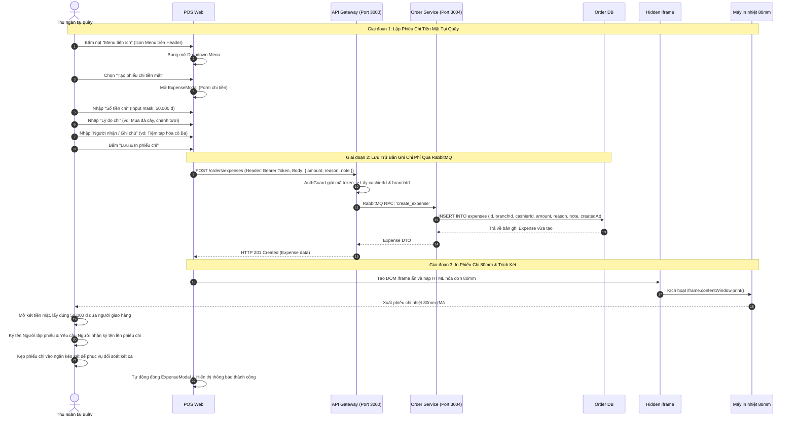
```mermaid
sequenceDiagram
    autonumber
    actor Cashier as Thu ngân tại quầy
    participant POS as POS Web
    participant GW as API Gateway (Port 3000)
    participant OS as Order Service (Port 3004)
    participant DB as Order DB
    participant Iframe as Hidden Iframe
    participant Printer as Máy in nhiệt 80mm

    Note over Cashier, Printer: Giai đoạn 1: Lập Phiếu Chi Tiền Mặt Tại Quầy
    Cashier->>POS: Bấm nút "Menu tiện ích" (Icon Menu trên Header)
    POS->>POS: Bung mở Dropdown Menu
    Cashier->>POS: Chọn "Tạo phiếu chi tiền mặt"
    POS->>POS: Mở ExpenseModal (Form chi tiền)
    Cashier->>POS: Nhập "Số tiền chi" (Input mask: 50.000 đ)
    Cashier->>POS: Nhập "Lý do chi" (vd: Mua đá cây, chanh tươi)
    Cashier->>POS: Nhập "Người nhận / Ghi chú" (vd: Tiệm tạp hóa cô Ba)
    Cashier->>POS: Bấm "Lưu & In phiếu chi"

    Note over POS, DB: Giai đoạn 2: Lưu Trữ Bản Ghi Chi Phí Qua RabbitMQ
    POS->>GW: POST /orders/expenses (Header: Bearer Token, Body: { amount, reason, note })
    GW->>GW: AuthGuard giải mã token -> Lấy cashierId & branchId
    GW->>OS: RabbitMQ RPC: 'create_expense'
    OS->>DB: INSERT INTO expenses (id, branchId, cashierId, amount, reason, note, createdAt)
    DB-->>OS: Trả về bản ghi Expense vừa tạo
    OS-->>GW: Expense DTO
    GW-->>POS: HTTP 201 Created (Expense data)

    Note over POS, Printer: Giai đoạn 3: In Phiếu Chi 80mm & Trích Két
    POS->>Iframe: Tạo DOM iframe ẩn và nạp HTML hóa đơn 80mm
    Iframe->>Printer: Kích hoạt iframe.contentWindow.print()
    Printer-->>Cashier: Xuất phiếu chi nhiệt 80mm (Mã #EXP-..., Số tiền, Chữ ký)
    Cashier->>Cashier: Mở két tiền mặt, lấy đúng 50.000 đ đưa người giao hàng
    Cashier->>Cashier: Ký tên Người lập phiếu & Yêu cầu Người nhận ký tên lên phiếu chi
    Cashier->>Cashier: Kẹp phiếu chi vào ngăn kéo két để phục vụ đối soát kết ca
    POS->>POS: Tự động đóng ExpenseModal & Hiển thị thông báo thành công
```

---

## 6. Luồng Vòng Đời Ca Làm Việc & Báo Cáo Kết Ca Bàn Giao (Work Shift Lifecycle & Handover)

Quy trình quản lý dòng tiền vận hành khép kín xuyên suốt một ca trực của Thu ngân: từ khi mở ca khai báo số tiền nhận bàn giao ban đầu, thu tiền bán hàng, xuất tiền chi khẩn cấp, đến thời điểm chốt sổ đối chiếu 3 chiều và in phiếu bàn giao kết ca 80mm.

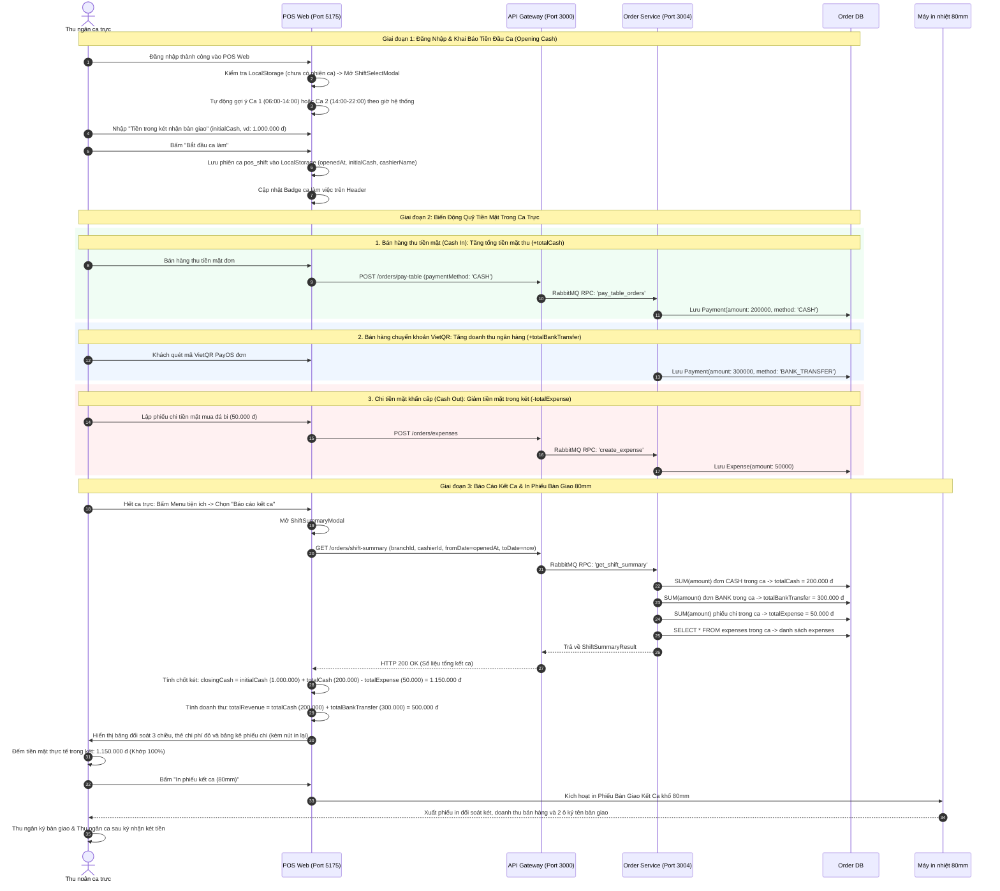
```mermaid
sequenceDiagram
    autonumber
    actor Cashier as Thu ngân ca trực
    participant POS as POS Web (Port 5175)
    participant GW as API Gateway (Port 3000)
    participant OS as Order Service (Port 3004)
    participant DB as Order DB
    participant Printer as Máy in nhiệt 80mm

    %% Giai đoạn 1: Mở ca & Khai báo tiền két
    Note over Cashier, DB: Giai đoạn 1: Đăng Nhập & Khai Báo Tiền Đầu Ca (Opening Cash)
    Cashier->>POS: Đăng nhập thành công vào POS Web
    POS->>POS: Kiểm tra LocalStorage (chưa có phiên ca) -> Mở ShiftSelectModal
    POS->>POS: Tự động gợi ý Ca 1 (06:00-14:00) hoặc Ca 2 (14:00-22:00) theo giờ hệ thống
    Cashier->>POS: Nhập "Tiền trong két nhận bàn giao" (initialCash, vd: 1.000.000 đ)
    Cashier->>POS: Bấm "Bắt đầu ca làm"
    POS->>POS: Lưu phiên ca pos_shift vào LocalStorage (openedAt, initialCash, cashierName)
    POS->>POS: Cập nhật Badge ca làm việc trên Header

    %% Giai đoạn 2: Hoạt động trong ca
    Note over Cashier, DB: Giai đoạn 2: Biến Động Quỹ Tiền Mặt Trong Ca Trực
    rect rgb(240, 253, 244)
        Note over Cashier, DB: 1. Bán hàng thu tiền mặt (Cash In): Tăng tổng tiền mặt thu (+totalCash)
        Cashier->>POS: Bán hàng thu tiền mặt đơn #101 (200.000 đ)
        POS->>GW: POST /orders/pay-table (paymentMethod: 'CASH')
        GW->>OS: RabbitMQ RPC: 'pay_table_orders'
        OS->>DB: Lưu Payment(amount: 200000, method: 'CASH')
    end
    rect rgb(239, 246, 255)
        Note over Cashier, DB: 2. Bán hàng chuyển khoản VietQR: Tăng doanh thu ngân hàng (+totalBankTransfer)
        Cashier->>POS: Khách quét mã VietQR PayOS đơn #102 (300.000 đ)
        OS->>DB: Lưu Payment(amount: 300000, method: 'BANK_TRANSFER')
    end
    rect rgb(255, 241, 242)
        Note over Cashier, DB: 3. Chi tiền mặt khẩn cấp (Cash Out): Giảm tiền mặt trong két (-totalExpense)
        Cashier->>POS: Lập phiếu chi tiền mặt mua đá bi (50.000 đ)
        POS->>GW: POST /orders/expenses
        GW->>OS: RabbitMQ RPC: 'create_expense'
        OS->>DB: Lưu Expense(amount: 50000)
    end

    %% Giai đoạn 3: Báo cáo kết ca & In phiếu bàn giao
    Note over Cashier, Printer: Giai đoạn 3: Báo Cáo Kết Ca & In Phiếu Bàn Giao 80mm
    Cashier->>POS: Hết ca trực: Bấm Menu tiện ích -> Chọn "Báo cáo kết ca"
    POS->>POS: Mở ShiftSummaryModal
    POS->>GW: GET /orders/shift-summary (branchId, cashierId, fromDate=openedAt, toDate=now)
    GW->>OS: RabbitMQ RPC: 'get_shift_summary'
    OS->>DB: SUM(amount) đơn CASH trong ca -> totalCash = 200.000 đ
    OS->>DB: SUM(amount) đơn BANK trong ca -> totalBankTransfer = 300.000 đ
    OS->>DB: SUM(amount) phiếu chi trong ca -> totalExpense = 50.000 đ
    OS->>DB: SELECT * FROM expenses trong ca -> danh sách expenses
    OS-->>GW: Trả về ShiftSummaryResult
    GW-->>POS: HTTP 200 OK (Số liệu tổng kết ca)
    
    POS->>POS: Tính chốt két: closingCash = initialCash (1.000.000) + totalCash (200.000) - totalExpense (50.000) = 1.150.000 đ
    POS->>POS: Tính doanh thu: totalRevenue = totalCash (200.000) + totalBankTransfer (300.000) = 500.000 đ
    POS->>Cashier: Hiển thị bảng đối soát 3 chiều, thẻ chi phí đỏ và bảng kê phiếu chi (kèm nút in lại)
    
    Cashier->>Cashier: Đếm tiền mặt thực tế trong két: 1.150.000 đ (Khớp 100%)
    Cashier->>POS: Bấm "In phiếu kết ca (80mm)"
    POS->>Printer: Kích hoạt in Phiếu Bàn Giao Kết Ca khổ 80mm
    Printer-->>Cashier: Xuất phiếu in đối soát két, doanh thu bán hàng và 2 ô ký tên bàn giao
    Cashier->>Cashier: Thu ngân ký bàn giao & Thu ngân ca sau ký nhận két tiền
```

---

## 7. Phân hệ Quản lý Nhân sự & Chấm công Sinh trắc học AI (Biometric Attendance)

Nhằm tối ưu hóa chi phí vận hành và loại bỏ hoàn toàn tình trạng chấm công hộ (buddy punching) trong mô hình chuỗi F&B, hệ thống tích hợp công nghệ thị giác máy tính Client-side AI (`face-api.js`) để xác thực khuôn mặt 1:1 trực tiếp trên trình duyệt máy POS, đối chiếu với ca chuẩn tự động và lưu vết ảnh chụp kiểm toán.

### 7.1. Quy trình Đăng ký Sinh trắc học khuôn mặt nhân viên (Face Enrollment)

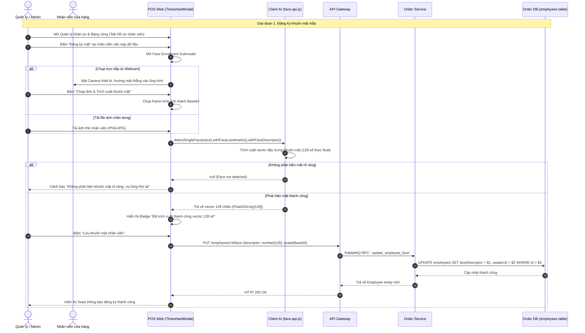
```mermaid
sequenceDiagram
    autonumber
    actor Manager as Quản lý / Admin
    actor Staff as Nhân viên cửa hàng
    participant Client as POS Web (TimesheetModal)
    participant AI as Client AI (face-api.js)
    participant GW as API Gateway
    participant OS as Order Service
    participant DB as Order DB (employees table)

    Note over Manager, DB: Giai đoạn 1: Đăng ký khuôn mặt mẫu
    Manager->>Client: Mở Quản lý nhân sự & Bảng công (Tab Hồ sơ nhân viên)
    Manager->>Client: Bấm "Đăng ký mặt" tại nhân viên cần nạp dữ liệu
    Client->>Client: Mở Face Enrollment Submodal
    alt Chụp trực tiếp từ Webcam
        Client->>Staff: Bật Camera thiết bị, hướng mặt thẳng vào ống kính
        Manager->>Client: Bấm "Chụp ảnh & Trích xuất khuôn mặt"
        Client->>Client: Chụp frame hình ảnh thành Base64
    else Tải file ảnh chân dung
        Manager->>Client: Tải ảnh thẻ nhân viên (PNG/JPG)
    end

    Client->>AI: detectSingleFace(input).withFaceLandmarks().withFaceDescriptor()
    AI->>AI: Trích xuất vector đặc trưng khuôn mặt (128 số thực float)
    alt Không phát hiện mặt rõ ràng
        AI-->>Client: null (Face not detected)
        Client-->>Manager: Cảnh báo "Không phát hiện khuôn mặt rõ ràng, vui lòng thử lại"
    else Phát hiện mặt thành công
        AI-->>Client: Trả về vector 128 chiều (Float32Array[128])
        Client->>Client: Hiển thị Badge "Đã trích xuất thành công vector 128 số"
        Manager->>Client: Bấm "Lưu khuôn mặt nhân viên"
        Client->>GW: PUT /employees/:id/face (descriptor: number[128], avatarBase64)
        GW->>OS: RabbitMQ RPC: 'update_employee_face'
        OS->>DB: UPDATE employees SET faceDescriptor = $1, avatarUrl = $2 WHERE id = $3
        DB-->>OS: Cập nhật thành công
        OS-->>GW: Trả về Employee entity mới
        GW-->>Client: HTTP 200 OK
        Client-->>Manager: Hiển thị Toast thông báo đăng ký thành công
    end
```

---

### 7.2. Quy trình Chấm công Kiosk AI tại quầy POS chống gian lận (Face Verification Check-in/out)

Hệ thống hỗ trợ 2 lối vào Kiosk linh hoạt:
1. **Lối vào 1 - Màn hình Đăng nhập (Login Screen):** Nhân viên bấm nút *"⏰ Chấm công Kiosk (Nhận diện khuôn mặt)"* ngay bên dưới form login để điểm danh trước khi thu ngân đăng nhập vào ca.
2. **Lối vào 2 - Thanh Header Thu ngân:** Thu ngân hoặc nhân viên giao ca bấm nút *"⏰ Chấm công Kiosk"* trực tiếp trên Header để mở camera 1-chạm mà không cần duyệt menu.

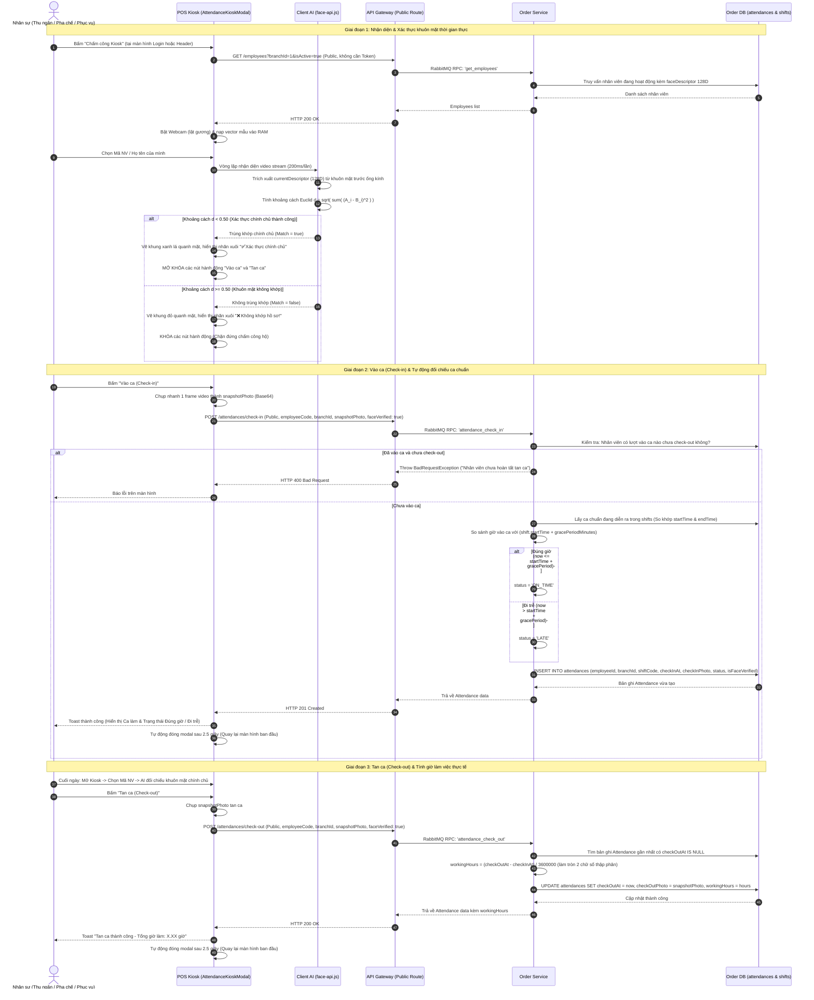
```mermaid
sequenceDiagram
    autonumber
    actor Staff as Nhân sự (Thu ngân / Pha chế / Phục vụ)
    participant Kiosk as POS Kiosk (AttendanceKioskModal)
    participant AI as Client AI (face-api.js)
    participant GW as API Gateway (Public Route)
    participant OS as Order Service
    participant DB as Order DB (attendances & shifts)

    Note over Staff, DB: Giai đoạn 1: Nhận diện & Xác thực khuôn mặt thời gian thực
    Staff->>Kiosk: Bấm "Chấm công Kiosk" (tại màn hình Login hoặc Header)
    Kiosk->>GW: GET /employees?branchId=1&isActive=true (Public, không cần Token)
    GW->>OS: RabbitMQ RPC: 'get_employees'
    OS->>DB: Truy vấn nhân viên đang hoạt động kèm faceDescriptor 128D
    DB-->>OS: Danh sách nhân viên
    OS-->>GW: Employees list
    GW-->>Kiosk: HTTP 200 OK
    Kiosk->>Kiosk: Bật Webcam (lật gương) & nạp vector mẫu vào RAM
    Staff->>Kiosk: Chọn Mã NV / Họ tên của mình
    Kiosk->>AI: Vòng lặp nhận diện video stream (200ms/lần)
    AI->>AI: Trích xuất currentDescriptor (128D) từ khuôn mặt trước ống kính
    AI->>AI: Tính khoảng cách Euclid d = sqrt( sum( (A_i - B_i)^2 ) )

    alt Khoảng cách d < 0.50 (Xác thực chính chủ thành công)
        AI-->>Kiosk: Trùng khớp chính chủ (Match = true)
        Kiosk->>Kiosk: Vẽ khung xanh lá quanh mặt, hiển thị nhãn xuôi "✅ Xác thực chính chủ"
        Kiosk->>Kiosk: MỞ KHÓA các nút hành động "Vào ca" và "Tan ca"
    else Khoảng cách d >= 0.50 (Khuôn mặt không khớp)
        AI-->>Kiosk: Không trùng khớp (Match = false)
        Kiosk->>Kiosk: Vẽ khung đỏ quanh mặt, hiển thị nhãn xuôi "❌ Không khớp hồ sơ!"
        Kiosk->>Kiosk: KHÓA các nút hành động (Chặn đứng chấm công hộ)
    end

    %% Hành động Vào ca
    Note over Staff, DB: Giai đoạn 2: Vào ca (Check-in) & Tự động đối chiếu ca chuẩn
    Staff->>Kiosk: Bấm "Vào ca (Check-in)"
    Kiosk->>Kiosk: Chụp nhanh 1 frame video thành snapshotPhoto (Base64)
    Kiosk->>GW: POST /attendances/check-in (Public, employeeCode, branchId, snapshotPhoto, faceVerified: true)
    GW->>OS: RabbitMQ RPC: 'attendance_check_in'
    OS->>DB: Kiểm tra: Nhân viên có lượt vào ca nào chưa check-out không?
    alt Đã vào ca và chưa check-out
        OS-->>GW: Throw BadRequestException ("Nhân viên chưa hoàn tất tan ca")
        GW-->>Kiosk: HTTP 400 Bad Request
        Kiosk-->>Staff: Báo lỗi trên màn hình
    else Chưa vào ca
        OS->>DB: Lấy ca chuẩn đang diễn ra trong shifts (So khớp startTime & endTime)
        OS->>OS: So sánh giờ vào ca với (shift.startTime + gracePeriodMinutes)
        alt Đúng giờ (now <= startTime + gracePeriod)
            OS->>OS: status = 'ON_TIME'
        else Đi trễ (now > startTime + gracePeriod)
            OS->>OS: status = 'LATE'
        end
        OS->>DB: INSERT INTO attendances (employeeId, branchId, shiftCode, checkInAt, checkInPhoto, status, isFaceVerified)
        DB-->>OS: Bản ghi Attendance vừa tạo
        OS-->>GW: Trả về Attendance data
        GW-->>Kiosk: HTTP 201 Created
        Kiosk-->>Staff: Toast thành công (Hiển thị Ca làm & Trạng thái Đúng giờ / Đi trễ)
        Kiosk->>Kiosk: Tự động đóng modal sau 2.5 giây (Quay lại màn hình ban đầu)
    end

    %% Hành động Tan ca
    Note over Staff, DB: Giai đoạn 3: Tan ca (Check-out) & Tính giờ làm việc thực tế
    Staff->>Kiosk: Cuối ngày: Mở Kiosk -> Chọn Mã NV -> AI đối chiếu khuôn mặt chính chủ
    Staff->>Kiosk: Bấm "Tan ca (Check-out)"
    Kiosk->>Kiosk: Chụp snapshotPhoto tan ca
    Kiosk->>GW: POST /attendances/check-out (Public, employeeCode, branchId, snapshotPhoto, faceVerified: true)
    GW->>OS: RabbitMQ RPC: 'attendance_check_out'
    OS->>DB: Tìm bản ghi Attendance gần nhất có checkOutAt IS NULL
    OS->>OS: workingHours = (checkOutAt - checkInAt) / 3600000 (làm tròn 2 chữ số thập phân)
    OS->>DB: UPDATE attendances SET checkOutAt = now, checkOutPhoto = snapshotPhoto, workingHours = hours
    DB-->>OS: Cập nhật thành công
    OS-->>GW: Trả về Attendance data kèm workingHours
    GW-->>Kiosk: HTTP 200 OK
    Kiosk-->>Staff: Toast "Tan ca thành công - Tổng giờ làm: X.XX giờ"
    Kiosk->>Kiosk: Tự động đóng modal sau 2.5 giây (Quay lại màn hình ban đầu)
```

---

### 7.3. Giải pháp Kỹ thuật: Bù trừ Tọa độ Un-mirror Canvas & Cơ chế Fallback PIN khẩn cấp

1. **Bù trừ Tọa độ Un-mirror Canvas trên Video Stream Lật gương:**
   - **Vấn đề:** Để người dùng có trải nghiệm thị giác tự nhiên giống như soi gương, luồng video webcam được áp dụng CSS `transform: scaleX(-1)` (class `-scale-x-100`). Tuy nhiên, nếu vẽ trực tiếp khung nhận diện và chữ trạng thái lên canvas overlay đặt trên video này, toàn bộ nội dung văn bản (ví dụ: nhãn "Chính chủ (62% khớp)") sẽ bị lật ngược từ phải qua trái.
   - **Thuật toán xử lý trên Canvas 2D:**
     - Giữ nguyên video stream ở chế độ lật gương (`-scale-x-100`).
     - Canvas vẽ overlay được đặt ở chế độ bình thường (không lật CSS).
     - Trước khi vẽ khung nhận diện và nhãn text, hệ thống tính toán lại tọa độ trục hoành:
       $$x_{\text{draw}} = \text{canvasWidth} - x_{\text{box}} - \text{width}_{\text{box}}$$
     - Vẽ khung viền chữ nhật và nhãn thông tin tại tọa độ $x_{\text{draw}}$.
     - **Kết quả:** Khung viền di chuyển đồng bộ 100% với khuôn mặt đã lật của người dùng trước ống kính, đồng thời chữ hiển thị xuôi chiều đọc tự nhiên từ trái sang phải mà không bị lộn ngược.

2. **Cơ chế Dự phòng bằng Mã PIN khẩn cấp (Emergency PIN Fallback):**
   - Trong trường hợp camera gặp sự cố kỹ thuật (hỏng webcam, phòng thiếu sáng nghiêm trọng hoặc nhân viên bị chấn thương khuôn mặt):
     - Kiosk cung cấp tùy chọn "Nhập mã PIN xác thực" (Mã PIN mặc định: `1234`).
     - Khi nhập đúng mã PIN được cấu hình trong bảng `employees`, hệ thống vẫn cho phép nhân viên bấm "Vào ca" hoặc "Tan ca" và đánh dấu cờ `isFaceVerified: false` kèm ảnh snapshot hiện tại để người quản lý dễ dàng hậu kiểm tra soát.

---

### 7.4. Quy trình Tự động Sinh Mã Nhân viên Mới Tăng Dần (Auto-increment Employee Code)

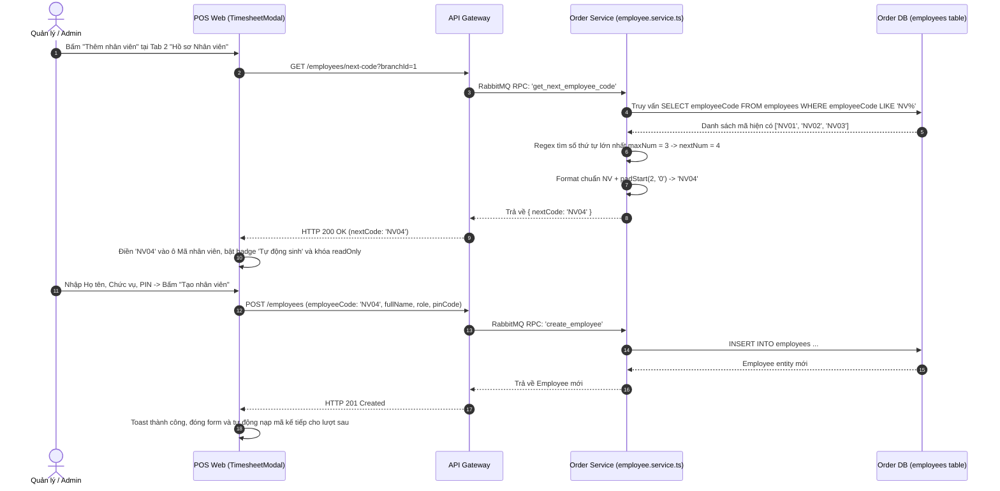
```mermaid
sequenceDiagram
    autonumber
    actor Admin as Quản lý / Admin
    participant POS as POS Web (TimesheetModal)
    participant GW as API Gateway
    participant OS as Order Service (employee.service.ts)
    participant DB as Order DB (employees table)

    Admin->>POS: Bấm "Thêm nhân viên" tại Tab 2 "Hồ sơ Nhân viên"
    POS->>GW: GET /employees/next-code?branchId=1
    GW->>OS: RabbitMQ RPC: 'get_next_employee_code'
    OS->>DB: Truy vấn SELECT employeeCode FROM employees WHERE employeeCode LIKE 'NV%'
    DB-->>OS: Danh sách mã hiện có ['NV01', 'NV02', 'NV03']
    OS->>OS: Regex tìm số thứ tự lớn nhất maxNum = 3 -> nextNum = 4
    OS->>OS: Format chuẩn NV + padStart(2, '0') -> 'NV04'
    OS-->>GW: Trả về { nextCode: 'NV04' }
    GW-->>POS: HTTP 200 OK (nextCode: 'NV04')
    POS->>POS: Điền 'NV04' vào ô Mã nhân viên, bật badge 'Tự động sinh' và khóa readOnly
    Admin->>POS: Nhập Họ tên, Chức vụ, PIN -> Bấm "Tạo nhân viên"
    POS->>GW: POST /employees (employeeCode: 'NV04', fullName, role, pinCode)
    GW->>OS: RabbitMQ RPC: 'create_employee'
    OS->>DB: INSERT INTO employees ...
    DB-->>OS: Employee entity mới
    OS-->>GW: Trả về Employee mới
    GW-->>POS: HTTP 201 Created
    POS->>POS: Toast thành công, đóng form và tự động nạp mã kế tiếp cho lượt sau
```

---

### 7.5. Luồng Chấm công Kiosk Độc lập từ Màn hình Đăng nhập (Login Kiosk Attendance Flow)

Quy trình cho phép nhân viên toàn quầy (Pha chế, Phục vụ, Thu ngân ca kế tiếp) hoàn tất điểm danh sinh trắc học ngay cả khi quầy POS chưa được đăng nhập tài khoản thu ngân:

1. **Khởi động:** Nhân viên đứng trước màn hình máy POS đang ở trạng thái Đăng nhập (`LoginScreen.tsx`).
2. **Kích hoạt Kiosk:** Nhấp vào nút nổi bật **"⏰ Chấm công Kiosk (Nhận diện khuôn mặt)"** (thiết kế viền xanh nét đứt `bg-blue-50/80 text-blue-700 border-2 border-dashed border-blue-300`).
3. **Mở modal Kiosk độc lập:** Component `AttendanceKioskModal` mở ra, tự động gọi API `GET /employees?branchId=1&isActive=true` (không cần Bearer Token) để nạp danh sách nhân sự chi nhánh 1 kèm vector khuôn mặt 128D.
4. **Xác thực khuôn mặt thời gian thực:** Nhân viên chọn tên mình, nhìn vào camera webcam. Mô hình AI client-side tính khoảng cách Euclid. Khi $d < 0.50$, hệ thống nhận diện chính chủ và mở khóa nút chấm công.
5. **Gửi kết quả:** Bấm "Vào ca" hoặc "Tan ca". Request gửi tới `POST /attendances/check-in` hoặc `check-out` (Public endpoint). Server lưu snapshot và giờ làm việc.
6. **Tự động đóng và khôi phục:** Modal hiển thị Toast kết quả chấm công trong 2.5 giây, sau đó tự động đóng lại. Màn hình quay về form đăng nhập ban đầu mà không làm gián đoạn hay ảnh hưởng đến phiên làm việc của hệ thống.

---

## 8. Luồng Lưu & Phục Hồi Hóa Đơn Tạm Tính (Hold / Draft Orders Workflow)

Quy trình giải phóng quầy thu ngân khi khách hàng đang gọi món cần tạm dừng để chờ người đi cùng hoặc đổi ý, cho phép phục vụ ngay khách tiếp theo mà không làm mất thông tin đơn trước đó:

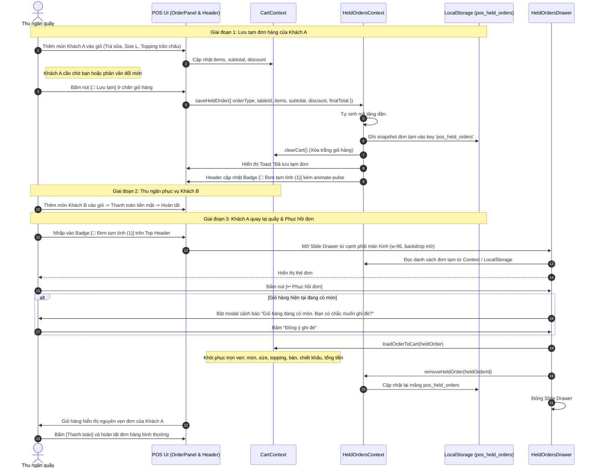
```mermaid
sequenceDiagram
    autonumber
    actor Cashier as Thu ngân quầy
    participant UI as POS UI (OrderPanel & Header)
    participant Cart as CartContext
    participant Held as HeldOrdersContext
    participant Storage as LocalStorage (pos_held_orders)
    participant Drawer as HeldOrdersDrawer

    %% Giai đoạn 1: Lưu tạm đơn hàng của Khách A
    Note over Cashier, Storage: Giai đoạn 1: Lưu tạm đơn hàng của Khách A
    Cashier->>UI: Thêm món Khách A vào giỏ (Trà sữa, Size L, Topping trân châu)
    UI->>Cart: Cập nhật items, subtotal, discount
    Note right of Cashier: Khách A cần chờ bạn hoặc phân vân đổi món
    Cashier->>UI: Bấm nút [💾 Lưu tạm] ở chân giỏ hàng
    UI->>Held: saveHeldOrder({ orderType, tableId, items, subtotal, discount, finalTotal })
    Held->>Held: Tự sinh mã tăng dần: #TAM-01 (format padStart 2 chữ số)
    Held->>Storage: Ghi snapshot đơn tạm vào key 'pos_held_orders'
    Held->>Cart: clearCart() (Xóa trắng giỏ hàng)
    Held->>UI: Hiển thị Toast "Đã lưu tạm đơn #TAM-01 thành công"
    Held->>UI: Header cập nhật Badge [📄 Đơn tạm tính (1)] kèm animate-pulse

    %% Giai đoạn 2: Phục vụ khách B bình thường
    Note over Cashier, Cart: Giai đoạn 2: Thu ngân phục vụ Khách B
    Cashier->>UI: Thêm món Khách B vào giỏ -> Thanh toán tiền mặt -> Hoàn tất

    %% Giai đoạn 3: Khách A quay lại và phục hồi đơn
    Note over Cashier, Storage: Giai đoạn 3: Khách A quay lại quầy & Phục hồi đơn
    Cashier->>UI: Nhấp vào Badge [📄 Đơn tạm tính (1)] trên Top Header
    UI->>Drawer: Mở Slide Drawer từ cạnh phải màn hình (w-96, backdrop mờ)
    Drawer->>Held: Đọc danh sách đơn tạm từ Context / LocalStorage
    Drawer-->>Cashier: Hiển thị thẻ đơn #TAM-01 (giờ tạo, số món, tổng tiền xanh in đậm)
    Cashier->>Drawer: Bấm nút [↩ Phục hồi đơn]
    alt Giỏ hàng hiện tại đang có món
        Drawer->>Cashier: Bật modal cảnh báo "Giỏ hàng đang có món. Bạn có chắc muốn ghi đè?"
        Cashier->>Drawer: Bấm "Đồng ý ghi đè"
    end
    Drawer->>Cart: loadOrderToCart(heldOrder)
    Note over Cart: Khôi phục trọn vẹn: món, size, topping, bàn, chiết khấu, tổng tiền
    Drawer->>Held: removeHeldOrder(heldOrderId)
    Held->>Storage: Cập nhật lại mảng pos_held_orders
    Drawer->>Drawer: Đóng Slide Drawer
    UI->>Cashier: Giỏ hàng hiển thị nguyên vẹn đơn của Khách A
    Cashier->>UI: Bấm [Thanh toán] và hoàn tất đơn hàng bình thường
```

### Các Tình Huống Ngoại Lệ & Cơ Chế Bảo Vệ
1. **Giỏ hàng rỗng:** Nút `[ 💾 Lưu tạm ]` tại chân `OrderPanel.tsx` tự động bị vô hiệu hóa (`disabled`) với con trỏ `not-allowed`, ngăn chặn việc tạo ra các đơn tạm rỗng vô nghĩa.
2. **Khôi phục đè giỏ hàng:** Nếu thu ngân đang vô tình có vài món mới trong giỏ mà lại bấm phục hồi một đơn tạm, hệ thống hiển thị modal xác nhận hai lựa chọn ("Hủy bỏ" hoặc "Đồng ý ghi đè"), ngăn ngừa 100% tình trạng mất dữ liệu giỏ hàng ngoài ý muốn.
3. **Hủy đơn tạm an toàn:** Cung cấp nút xóa từng đơn tạm và nút "Hủy tất cả đơn tạm", đều có hộp thoại xác nhận trước khi thực thi xóa dữ liệu khỏi `localStorage`.
4. **Bền vững khi tải lại trang:** Dữ liệu đơn tạm được lưu trực tiếp vào `localStorage.pos_held_orders`, do đó khi thu ngân vô tình nhấn F5 hoặc trình duyệt tự refresh, danh sách đơn tạm vẫn được bảo toàn nguyên vẹn.

---

## 9. Luồng Kiểm Soát Quyền Hạn RBAC & Cơ Chế Ném Ngoại Lệ Tường Minh (RolesGuard Workflow)

Quy trình thẩm định quyền truy cập người dùng tại API Gateway trước khi chuyển tiếp yêu cầu đến các microservices:

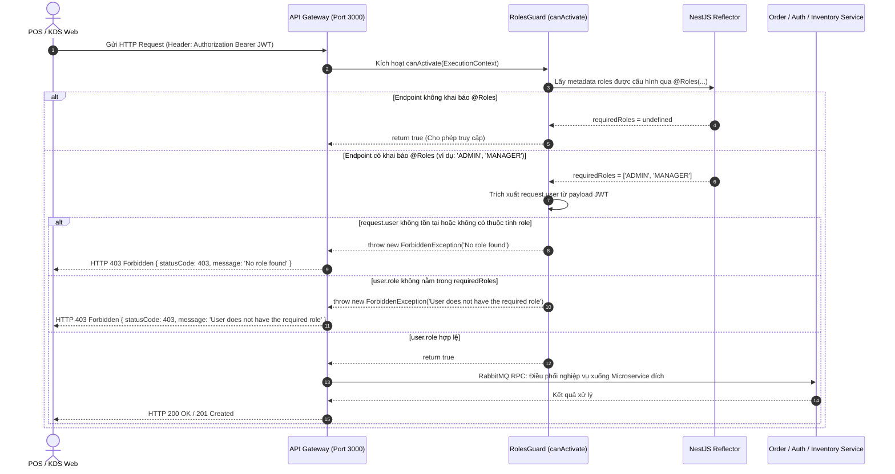
```mermaid
sequenceDiagram
    autonumber
    actor Client as POS / KDS Web
    participant GW as API Gateway (Port 3000)
    participant Guard as RolesGuard (canActivate)
    participant Reflector as NestJS Reflector
    participant Service as Order / Auth / Inventory Service

    Client->>GW: Gửi HTTP Request (Header: Authorization Bearer JWT)
    GW->>Guard: Kích hoạt canActivate(ExecutionContext)
    Guard->>Reflector: Lấy metadata roles được cấu hình qua @Roles(...)
    alt Endpoint không khai báo @Roles
        Reflector-->>Guard: requiredRoles = undefined
        Guard-->>GW: return true (Cho phép truy cập)
    else Endpoint có khai báo @Roles (ví dụ: 'ADMIN', 'MANAGER')
        Reflector-->>Guard: requiredRoles = ['ADMIN', 'MANAGER']
        Guard->>Guard: Trích xuất request.user từ payload JWT
        alt request.user không tồn tại hoặc không có thuộc tính role
            Guard-->>GW: throw new ForbiddenException('No role found')
            GW-->>Client: HTTP 403 Forbidden { statusCode: 403, message: 'No role found' }
        else user.role không nằm trong requiredRoles
            Guard-->>GW: throw new ForbiddenException('User does not have the required role')
            GW-->>Client: HTTP 403 Forbidden { statusCode: 403, message: 'User does not have the required role' }
        else user.role hợp lệ
            Guard-->>GW: return true
            GW->>Service: RabbitMQ RPC: Điều phối nghiệp vụ xuống Microservice đích
            Service-->>GW: Kết quả xử lý
            GW-->>Client: HTTP 200 OK / 201 Created
        end
    end
```

